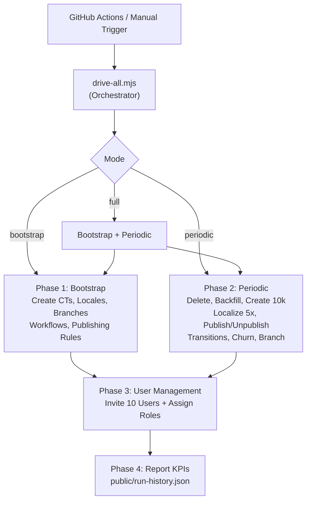
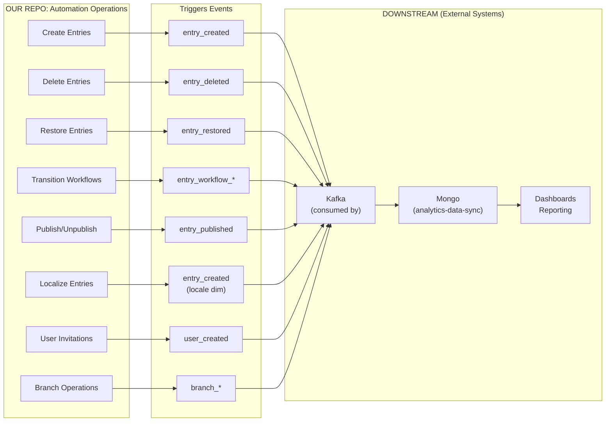

# Contentstack Metering Automation Framework

**Production-grade automation for comprehensive Contentstack Content Management API testing, meter coverage, and realistic content lifecycle simulation.**

## Overview

This framework automates complex content lifecycle patterns in Contentstack to:
- **Drive meter events** across all dimensions (users, branches, locales, workflows, stages)
- **Test multi-user scenarios** with auto-created and auto-managed users
- **Simulate realistic content aging** with entry restoration and tiered retention
- **Cover unmeasured analytics dimensions** (in-progress, deleted, stalled, multi-actor, orphan handling)
- **Self-heal on missing prerequisites** (auto-create locales, workflows, CMS roles, etc.)

**No manual setup required** — the automation creates and manages everything it needs.

---

## Architecture

### High-Level Flow



### Data Flow (This Repo Only)

**This repository performs CMA operations. Downstream systems handle analytics pipeline.**



---

## Key Scripts

| Script | Purpose | Triggers | Output |
|--------|---------|----------|--------|
| `drive-all.mjs` | Orchestrator (--mode bootstrap/periodic/full) | CI/manual | KPI report |
| `bootstrap-from-manifest.mjs` | Create CTs from manifest | Bootstrap phase | CT counts |
| `seed-locales-branches.mjs` | Create locales + branches | Bootstrap phase | Locale/branch UIDs |
| `seed-workflows.mjs` | Create workflows + assign stages | Bootstrap phase | Workflow UIDs |
| `delete-old-entries.mjs` | Tiered retention (3 age bands) | Periodic phase | Delete counts per band |
| `backfill-aged-entries.mjs` | Restore from trash if below targets | Periodic phase | Restore counts |
| `periodic-entries-from-manifest.mjs` | Bulk create entries (10k/run) | Periodic phase | Create counts |
| `localize-entries.mjs` | Multi-locale localization | Periodic phase | Localize counts |
| `bulk-publish-cycle.mjs` | Publish/unpublish ratio | Periodic phase | Publish/unpublish counts |
| `seed-workflows.mjs` | Transition entries (5 patterns) | Periodic phase | Transition counts |
| `churn-orphans.mjs` | Edge cases (disable, detach, restore) | Periodic phase | Churn counts |
| `branch-lifecycle.mjs` | 30-branch lineage + dynamic CTs | Periodic phase | Branch + entry counts |
| `edit-after-publish.mjs` | Create in-progress entries | Periodic phase | Edit counts |
| `permanent-deletes.mjs` | Hard delete entries | Periodic phase | Delete counts |
| `aged-stalls.mjs` | Create stalled entries | Periodic phase | Transition counts |
| `no-workflow-ct.mjs` | Create entries on bare CT | Periodic phase | Entry counts |
| `multi-actor-create-publish.mjs` | Two-user create/publish split | Periodic phase | Create/publish counts |
| `branch-locale-deletion.mjs` | Stage + delete for orphan testing | Periodic phase | Branch delete counts |
| `invite-users.mjs` | Invite 10 users + assign roles | Periodic phase | User counts + role assignments |

---

## Self-Healing Logic

### Missing Prerequisites Auto-Creation

| Failure Scenario | Auto-Healing | Location |
|-----------------|--------------|----------|
| Locale doesn't exist | Create with fallback chain | `localize-entries.mjs` |
| Workflow not found | Create with default stages | `aged-stalls.mjs` |
| Content type missing | Create with schema | `lib/cma.mjs` helper |
| User has no CMS role | Assign role via shareStack | `multi-actor.mjs`, `invite-users.mjs` |
| No trashed entries | Graceful skip | `backfill-aged-entries.mjs` |
| Workflow < 2 stages | Skip scenario | `aged-stalls.mjs` |

### Auto-Created Resources

- **Locales:** en-gb, fr-fr, fr-ca, de-de, de-at (with fallback chains)
- **Workflows:** Editorial Review, Marketing Approval, Quick Publish
- **Content Types:** demo_plain_text, demo_json_rte, demo_reference, demo_group, demo_blocks + dynamics
- **Branches:** 30-branch lineage (bl-{timestamp}-1 through bl-{timestamp}-30)
- **Users:** 10 new invitations per run (invite-{timestamp}-{random}@test.contentstack.com)
- **CMS Roles:** Auto-assigned to all users (Developer/Contributor role)

---

## Meter Coverage

### Dimensions Covered

| Meter | Dimension | Script | Driver Event |
|-------|-----------|--------|--------------|
| entries_created | locale | localize-entries.mjs | Localization by non-master locale |
| entries_created | content_type | periodic-entries-from-manifest.mjs | Create per CT |
| entries_created | branch | branch-lifecycle.mjs | Create on lineage branches |
| entries_published | user_uid | multi-actor-create-publish.mjs | Different creator/publisher |
| entries_in_progress | — | edit-after-publish.mjs | Publish then edit without republish |
| entries_deleted | — | permanent-deletes.mjs | Hard delete (not soft) |
| entries_without_workflow | — | no-workflow-ct.mjs | Create on bare CT |
| stalled_by_stage | workflow_uid | aged-stalls.mjs | Entries stuck in mid-stages |
| snapshot Axis 3 (branch) | branch_uid | branch-lifecycle.mjs | Lineage branch delete |
| snapshot Axis 4 (locale) | locale_code | branch-locale-deletion.mjs | Locale delete post-stage |
| org_users | — | invite-users.mjs | User invitation + role assignment |

---

## Configuration

### Required Environment Variables

```bash
# Stack Auth
CONTENTSTACK_API_KEY=your_api_key
CONTENTSTACK_MANAGEMENT_TOKEN=your_token
CONTENTSTACK_PUBLISH_ENVIRONMENT=production

# User Auth (for transitions, publishing, UI automation)
CONTENTSTACK_USER_EMAIL=user@example.com
CONTENTSTACK_USER_PASSWORD=password
```

### Optional Tuning (All have sensible defaults)

```bash
# Retention Policies
CONTENTSTACK_RETENTION_TARGET_OVER_30D=5000       # Keep 5k entries > 30d old
CONTENTSTACK_RETENTION_TARGET_15_30D=10000        # Keep 10k entries 15-30d old
CONTENTSTACK_RETENTION_TARGET_7_15D=20000         # Keep 20k entries 7-15d old

# Concurrency & Volumes
CONTENTSTACK_PERIODIC_CONCURRENCY=12              # Parallel creates per CT
CONTENTSTACK_DELETE_CONCURRENCY=10                # Parallel deletes
CONTENTSTACK_BRANCH_LINEAGE_COUNT=30              # Branches in lineage
CONTENTSTACK_BRANCH_ENTRIES_PER_CT=50             # Entries per branch
CONTENTSTACK_INVITE_COUNT=10                      # Users to invite per run

# Ratios
CONTENTSTACK_PUBLISH_RATIO=0.6                    # Fraction of entries to publish
CONTENTSTACK_UNPUBLISH_RATIO=0.15                 # Fraction to unpublish
CONTENTSTACK_BRANCH_CHURN_PERCENTAGE=0.2          # Disable/detach ratio (not delete)
```

---

## Running the Automation

### Bootstrap (One-time setup)

```bash
node --env-file=.env scripts/drive-all.mjs --mode bootstrap
```

Creates all content foundations (CTs, locales, branches, workflows).

### Periodic (Every 5 minutes in CI)

```bash
node --env-file=.env scripts/drive-all.mjs --mode periodic
```

Drives full lifecycle: delete → backfill → create → localize → publish → transition → churn → branch.

### Full (Bootstrap + Periodic)

```bash
node --env-file=.env scripts/drive-all.mjs --mode full
```

---

## Monitoring & Analytics

### Dashboard

Navigate to `/runs` after first run to see:
- **Runs & Reliability:** success rates, green streaks, p95 duration
- **Entries Lifecycle:** created/deleted/localized counts
- **Publish & Locale:** publish/unpublish/transition metrics
- **Workflow & Churn:** churn operations, edge cases
- **Branch Lifecycle:** branch/entry/CT counts
- **Meter-Coverage Scenarios:** per-scenario KPIs
- **Errors & Coverage:** failure tracking, gaps

### Run History

Appended to `public/run-history.json` after each run:
- Timestamp, mode, instance
- Per-step planned/actual/failed counts
- Aggregated KPIs
- Error audit log

---

## Troubleshooting

| Error | Cause | Solution |
|-------|-------|----------|
| "Language was not found (422)" | Locale missing | Auto-created; reload |
| "Workflow not found" | Workflow missing | Auto-created; reload |
| "Access denied (401)" | User lacks CMS role | Auto-assigned; retry |
| "Entries > 30d deleted" | Retention trimmed aged data | Backfill restores from trash |
| "Localize failed (422)" | Non-existent target locale | Auto-create + retry next run |
| "No trashed entries" | Never created entries to delete | Skip scenario gracefully |

---

## Architecture Decisions

### Why Auto-Create Instead of Fail?

Production systems must handle missing prerequisites gracefully. Pre-creating every resource via separate setup steps is brittle and error-prone. **Self-healing at the point of use** is more reliable:
- Locale missing → create it (1 API call)
- Workflow missing → create it (1 API call)
- User has no role → assign it (1 API call)

### Why No Teardown?

`analytics-data-sync` nightly cron scans Mongo for aged snapshots. Deleting branches/entries/CTs after each run means **no aged data exists** for the next run. Instead:
- Set `cleanup=false` (entries + branches persist)
- Tiered retention keeps data bounded
- Backfill restores from trash if band falls below target

### Why 30-Branch Lineage?

10x volume target:
- 3 branches × 5 entries = 15 entries (baseline)
- 30 branches × 50 entries = 1,500 entries + dynamic CTs
- Plus 10k periodic entries per run
- Plus restoration from trash
= Rich, realistic dataset for meter coverage

### Why Playwright for User Invitations?

Contentstack org-admin APIs don't expose user invitation endpoints. Playwright UI automation:
- Works with existing org-admin interface
- No company-repo modifications needed
- Auto-discovers users from org pool
- Auto-assigns CMS roles immediately

---

## Dependencies

- **Node 24+** (async/await, native fetch, top-level await)
- **Contentstack Management API** (REST, auth via token or user session)
- **Playwright** (for org-admin UI automation)
- **Fetch API** (Node 18+ native)

---

## CI/CD Integration

### GitHub Actions Workflow

```yaml
name: Periodic Automation

on:
  schedule:
    - cron: '*/5 * * * *'  # Every 5 minutes
  workflow_dispatch:        # Manual trigger

jobs:
  periodic:
    runs-on: ubuntu-latest
    steps:
      - uses: actions/checkout@v4
      - uses: actions/setup-node@v4
        with:
          node-version: 24
      - run: npm ci
      - run: npm run automate:drive:ci -- --mode periodic
        env:
          CONTENTSTACK_API_KEY: ${{ secrets.CONTENTSTACK_API_KEY }}
          CONTENTSTACK_MANAGEMENT_TOKEN: ${{ secrets.CONTENTSTACK_MANAGEMENT_TOKEN }}
          CONTENTSTACK_USER_EMAIL: ${{ secrets.CONTENTSTACK_USER_EMAIL }}
          CONTENTSTACK_USER_PASSWORD: ${{ secrets.CONTENTSTACK_USER_PASSWORD }}
          CONTENTSTACK_PUBLISH_ENVIRONMENT: production
```

---

## License

Internal Contentstack project. See LICENSE file.
