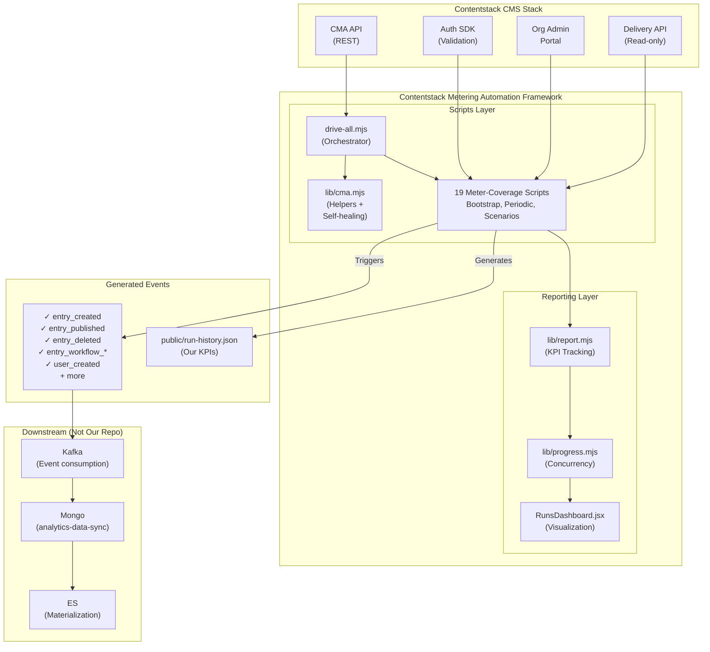
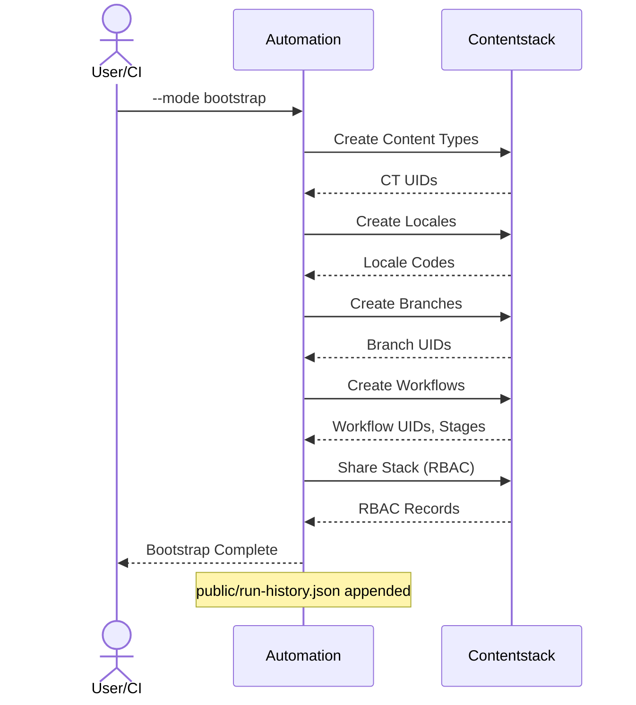
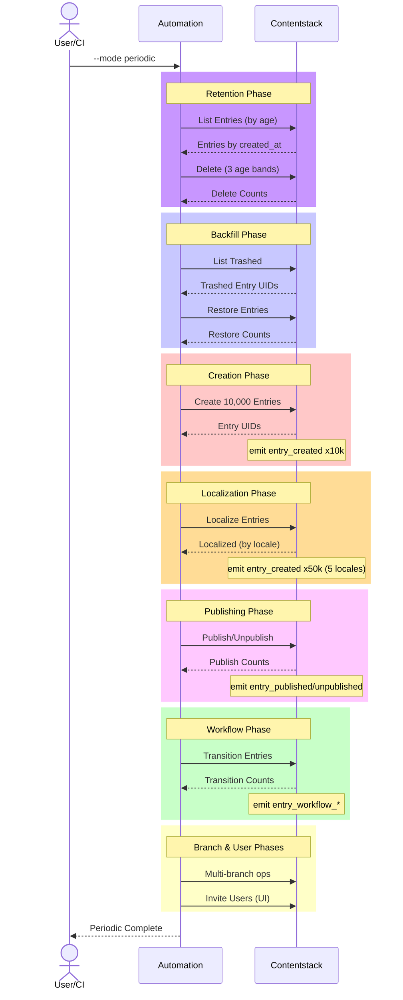
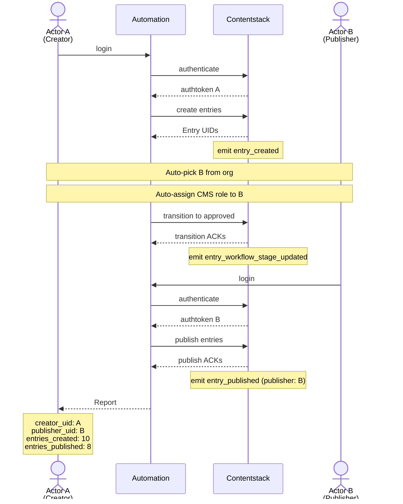
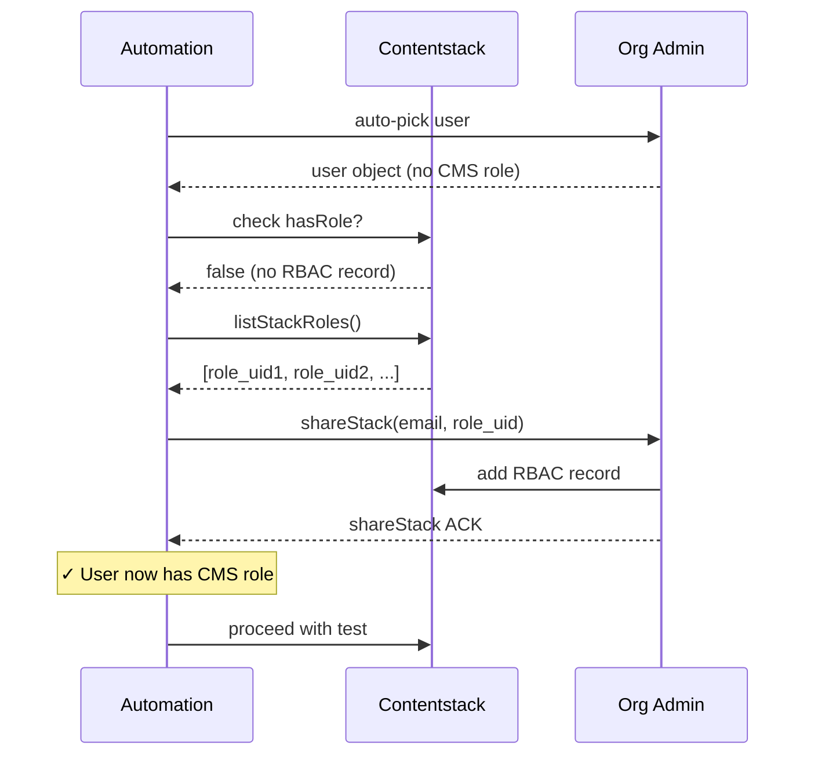
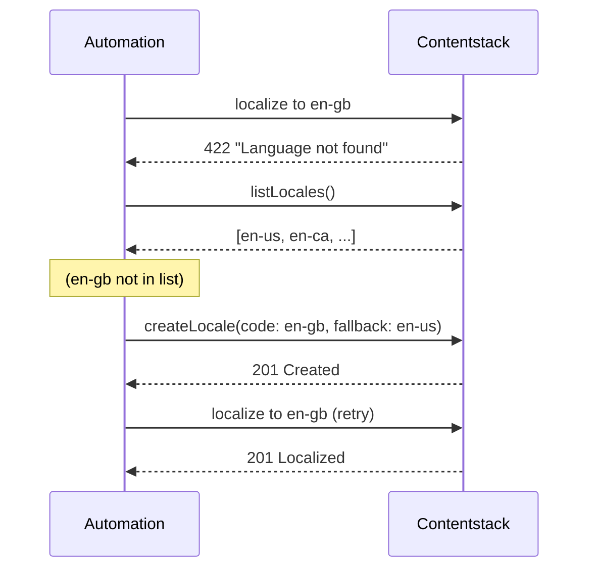

# Design Documentation

## High-Level Architecture (HLA)



---

## Sequence Diagrams

### Bootstrap Flow



### Periodic Entry Lifecycle



### Multi-Actor Create-Publish Sequence



### Self-Healing: Missing CMS Role



### Self-Healing: Missing Locale



---

## Low-Level Design (LLD)

### Entry Creation with Concurrency

```javascript
CREATE_ENTRIES(concurrency = 12) {
  pool = createWorkerPool(concurrency)
  for (ct in contentTypes) {
    entries_to_create = CONTENTSTACK_PERIODIC_TOTAL / len(contentTypes)
    
    while (entries_to_create > 0) {
      batch = entries_to_create.slice(0, concurrency)
      
      for (entry in batch) parallel {
        title = generate_unique_title()
        fields = resolve_placeholders(fields)
        
        result = POST /v3/content_types/{ct}/entries {
          entry: { title, ...fields }
        }
        
        if result.ok {
          kpis.created++
        } else if result.error == 133 { // entry cap
          kpis.capHit++
          stop_creation()
        } else {
          kpis.failed++
        }
      }
      
      entries_to_create -= batch.length
      sleep(100ms) // brief pause before next batch
    }
  }
  
  report(kpis)
}
```

### Tiered Retention with Age Bands

```javascript
TIERED_RETENTION() {
  now = Date.now()
  
  bands = [
    { name: ">30d",   min_age: 30*day,  max_age: ∞,       keep: 5000  },
    { name: "15-30d", min_age: 15*day,  max_age: 30*day,  keep: 10000 },
    { name: "7-15d",  min_age: 7*day,   max_age: 15*day,  keep: 20000 },
  ]
  
  for (ct in contentTypes) {
    for (band in bands) {
      entries = GET /entries {
        query: {
          created_at: {
            $gte: now - band.max_age,
            $lt:  now - band.min_age
          }
        },
        include_count: true
      }
      
      count = entries.length
      excess = max(0, count - band.keep)
      
      if excess > 0 {
        to_delete = entries.sort_by(created_at).slice(0, excess)
        
        for (entry in to_delete) parallel {
          DELETE /entries/{uid}
          kpis.deleted++
          kpis.bands[band.name]++
        }
      }
    }
  }
  
  report(kpis)
}
```

### Workflow Transition with 5 Patterns

```javascript
WORKFLOW_TRANSITIONS(rng_seed) {
  rng = mulberry32(rng_seed) // deterministic
  
  patterns = {
    linear:      [0, 1, 2],           // Draft → Review → Approved
    skip:        [0, 2],              // Draft → Approved (skip Review)
    rework:      [0, 1, 0, 1, 2],    // Draft → Review → Draft → Review → Approved
    partialStall: [0, 1],             // Draft → Review (stuck)
    firstOnly:   [0],                 // Draft only (no transition)
  }
  
  weights = DEFAULT_PATTERN_WEIGHTS // {linear: 0.3, skip: 0.1, ...}
  
  for (entry in entries) {
    pattern = pick_weighted(patterns, weights, rng)
    stops = pattern.map(idx => stages[idx])
    
    for (stop in stops) {
      result = PUT /entries/{uid}/transition {
        _workflow: {
          workflow_uid: wf.uid,
          stage_uid: stop.uid,
          assigned_to: [user],
          comment: `auto:${pattern}:${stop.name}`
        }
      }
      
      if result.ok {
        kpis.transitions++
      } else if result.status == 422 {
        // transit not allowed from current stage
        kpis.transitionsSkipped++
      } else {
        kpis.failed++
      }
    }
  }
  
  report(kpis)
}
```

### Backfill from Trashed Entries

```javascript
BACKFILL_AGED_ENTRIES() {
  now = Date.now()
  
  bands = [
    { name: ">30d",   start_age: 30*day,  end_age: 100*day, target: 5000  },
    { name: "15-30d", start_age: 15*day,  end_age: 30*day,  target: 10000 },
    { name: "7-15d",  start_age: 7*day,   end_age: 15*day,  target: 20000 },
  ]
  
  for (band in bands) {
    trashed = GET /entries {
      query: {
        created_at: {
          $gte: now - band.end_age,
          $lt:  now - band.start_age
        },
        _metadata: { deleted_at: { $exists: true } }
      }
    }
    
    count = trashed.length
    deficit = max(0, band.target - count)
    
    if deficit == 0 {
      continue // band is full
    }
    
    to_restore = trashed.slice(0, deficit)
    
    for (entry in to_restore) parallel {
      result = PUT /entries/{uid}/restore {
        entry: { locale }
      }
      
      if result.ok {
        kpis.restored++
      }
    }
  }
  
  report(kpis)
}
```

### Multi-Locale Localization with Auto-Create

```javascript
LOCALIZE_ENTRIES() {
  targets = [en-gb, fr-fr, fr-ca, de-de, de-at] // from manifest
  
  // STEP 1: Ensure all target locales exist
  available = GET /locales
  available_codes = available.map(l => l.code)
  
  for (target in targets) {
    if NOT available_codes.includes(target) {
      locale_info = manifest.locales.find(l => l.code == target)
      
      result = POST /locales {
        locale: {
          code: target,
          name: locale_info.name,
          fallback_locale: locale_info.fallback
        }
      }
      
      if result.ok {
        available_codes.add(target)
      }
    }
  }
  
  valid_targets = targets.filter(t => available_codes.includes(t))
  
  if valid_targets.empty() {
    return // no valid locales
  }
  
  // STEP 2: Localize entries
  for (ct in contentTypes) {
    entries = GET /entries {
      limit: 10, // max per CT
      desc: created_at
    }
    
    for (entry in entries) {
      for (locale in valid_targets) parallel {
        localized_title = `[${locale.upper()}] ${entry.title}`
        
        result = PUT /entries/{uid}/localize {
          entry: {
            locale: locale,
            title: localized_title,
            ...other_fields
          }
        }
        
        if result.ok {
          kpis.localized++
        } else {
          kpis.failed++
        }
      }
    }
  }
  
  report(kpis)
}
```

---

## Code Structure

```
scripts/
├── drive-all.mjs                    # Main orchestrator
├── lib/
│  ├── cma.mjs                       # CMA helpers + self-healing
│  ├── progress.mjs                  # Progress tracking
│  ├── report.mjs                    # KPI reporting
│  ├── workflow-patterns.mjs          # Pattern library
│  ├── entry-placeholders.mjs         # Placeholder resolution
│  ├── schema-from-fields.mjs         # CT schema generation
│  └── totp.mjs                       # 2FA
├── [Bootstrap scripts]
│  ├── bootstrap-from-manifest.mjs
│  ├── seed-locales-branches.mjs
│  ├── seed-workflows.mjs
│  └── seed-publishing-rules.mjs
├── [Periodic scripts]
│  ├── delete-old-entries.mjs
│  ├── backfill-aged-entries.mjs
│  ├── periodic-entries-from-manifest.mjs
│  ├── localize-entries.mjs
│  ├── bulk-publish-cycle.mjs
│  ├── churn-orphans.mjs
│  └── branch-lifecycle.mjs
├── [Meter-coverage scripts]
│  ├── edit-after-publish.mjs
│  ├── permanent-deletes.mjs
│  ├── aged-stalls.mjs
│  ├── no-workflow-ct.mjs
│  ├── multi-actor-create-publish.mjs
│  └── branch-locale-deletion.mjs
├── [User management]
│  └── invite-users.mjs
├── [Manifests]
│  ├── content-types.manifest.json
│  ├── workflows.manifest.json
│  ├── locales-branches.manifest.json
│  └── publishing-rules.manifest.json
└── [Config]
    └── .env.example
```

---

## Error Handling Strategy

### Graceful Degradation

- **Single entry fails** → log + continue (don't block batch)
- **Batch fails** → skip batch + continue (don't block CT)
- **CT fails** → skip CT + continue (don't block automation)
- **Workflow missing** → auto-create + retry
- **Locale missing** → auto-create + retry
- **User has no role** → auto-assign + retry

### Retryable vs Terminal Errors

| Error | HTTP | Retryable | Action |
|-------|------|-----------|--------|
| Rate limit | 429 | Yes | Sleep + retry |
| Entry cap hit | 133 | No | Log + stop |
| Invalid field | 422 | No | Log + skip |
| Not found | 404 | No | Auto-create (if applicable) + retry |
| Permission denied | 401 | No | Auto-assign role + retry |
| Server error | 5xx | Yes | Exponential backoff |

---

## Performance Metrics

### Throughput Targets

| Operation | Volume | Concurrency | Batch Size | Est. Duration |
|-----------|--------|-------------|------------|---------------|
| Create entries | 10,000 | 12 | 12 | ~5 min |
| Localize | 5,000 | 6 | 50 | ~8 min |
| Publish | 6,000 | 10 | 100 | ~3 min |
| Delete | 6,000 | 10 | 100 | ~3 min |
| Transitions | 2,000 | 8 | 8 | ~2 min |
| **Total periodic** | — | — | — | **~25 min** |

### Memory & CPU

- Single run: ~200MB heap, 1 CPU core
- CI runner: 2GB, 2 CPU (headroom for Playwright)
- No persistent connections (stateless)

---

## Security Considerations

### Token Management

- **Management token**: stored in CI secrets, used for CMA operations
- **User authtoken**: obtained via login (user/pass), cached in memory, cleared on exit
- **Never commit credentials**

### Rate Limiting

- Contentstack CMA: 10 req/sec (soft), 60 req/min (hard)
- Automation respects: 50ms sleep between requests + exponential backoff on 429
- Concurrent workers queue on limits (no thundering herd)

### Audit Trail

- Every operation logs to console + run-history.json
- GitHub Actions logs are retained for 90 days
- Runs tagged with timestamp, runner, commit SHA

---

## Testing Strategy

### Unit Tests

- Helper functions (cma.mjs, progress.mjs, etc.)
- Placeholder resolution logic
- Schema generation

### Integration Tests

- Bootstrap flow (create → verify)
- Periodic flow (delete → create → localize → publish)
- Self-healing scenarios (missing locale, missing role)

### Staging/Prod

- Dry-run mode (--dry-run flag)
- Isolated stack for testing
- Monitoring dashboard to verify metering events

