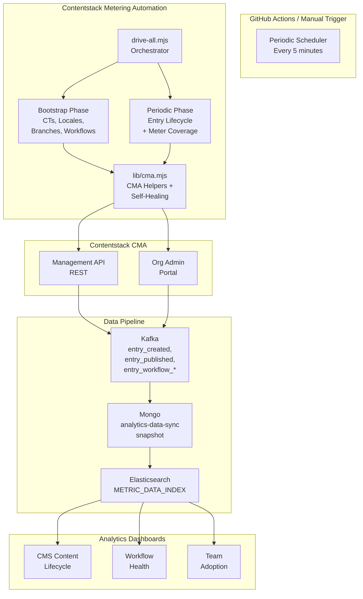
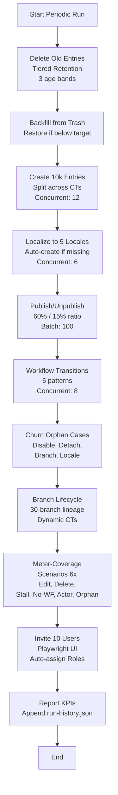
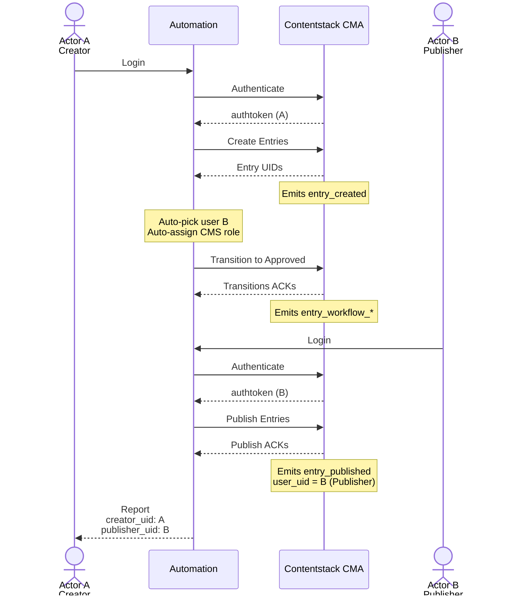
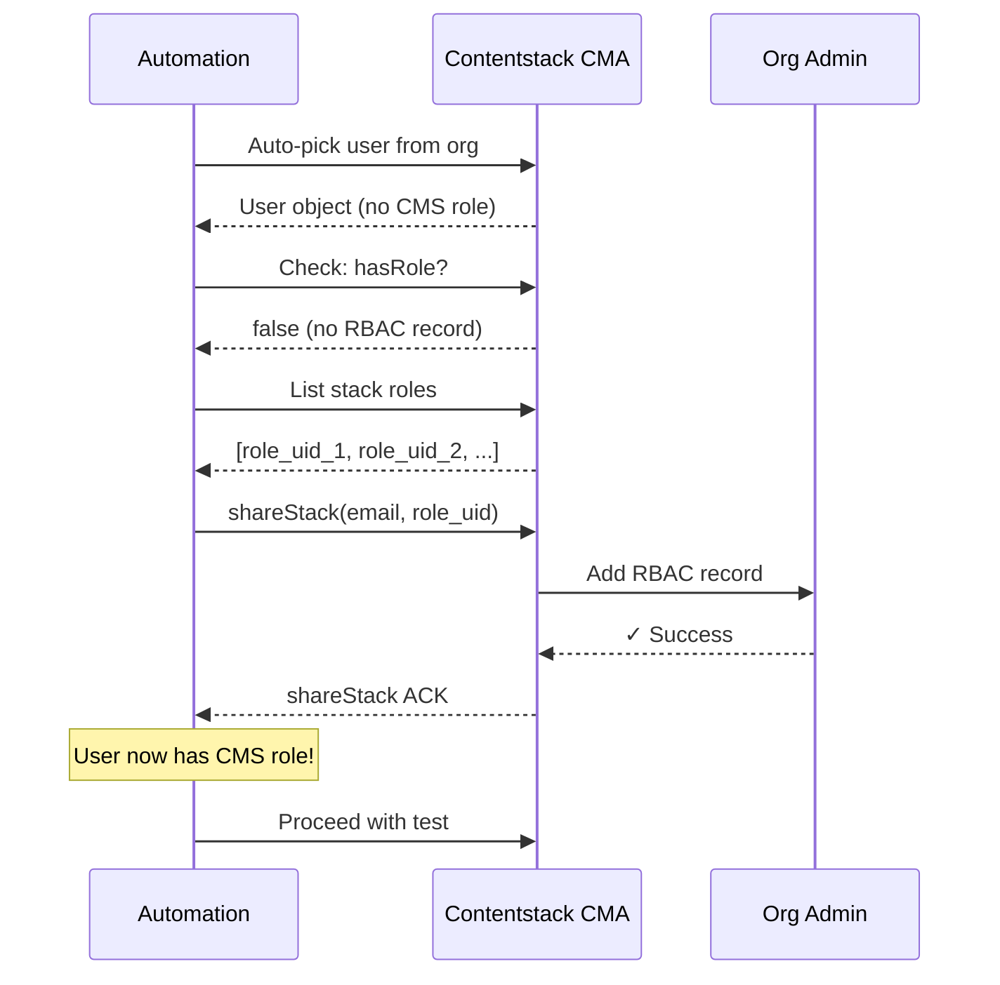
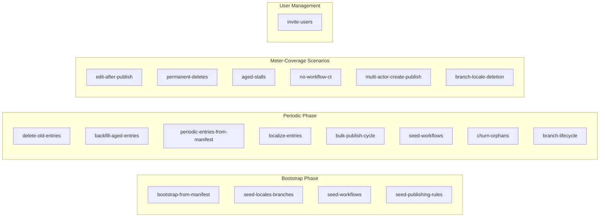

# Contentstack Metering Automation Framework

**Production-grade automation for comprehensive Contentstack CMA testing, meter coverage, and realistic content lifecycle simulation.**

> 📖 **Full documentation:** See [AUTOMATION_FRAMEWORK.md](./AUTOMATION_FRAMEWORK.md) (config & troubleshooting), [DESIGN.md](./DESIGN.md) (architecture & algorithms), [PRD.md](./PRD.md) (requirements & decisions)

---

## Table of Contents

- [Overview](#overview)
- [Architecture](#architecture)
- [Quick Start](#quick-start)
- [Scripts & Meter Mapping](#scripts--meter-mapping)
- [Self-Healing Logic](#self-healing-logic)
- [Configuration](#configuration)
- [Running the Automation](#running-the-automation)
- [Monitoring & Analytics](#monitoring--analytics)
- [CI/CD Integration](#cicd-integration)

---

## Overview

This framework automates complex content lifecycle patterns in Contentstack to:

✅ **Drive meter events** across all dimensions (users, branches, locales, workflows, stages)  
✅ **Test multi-user scenarios** with auto-created and auto-managed users  
✅ **Simulate realistic content aging** with entry restoration and tiered retention  
✅ **Cover unmeasured analytics dimensions** (in-progress, deleted, stalled, multi-actor, orphan handling)  
✅ **Self-heal on missing prerequisites** (auto-create locales, workflows, CMS roles)  

**No manual setup required** — the automation creates and manages everything it needs.

### Problem It Solves

Analytics dashboards (CMS Content Lifecycle, Workflow Health, Team Adoption) depend on metering events from CMA operations. Current testing is shallow:
- Only fresh entries (no aged data)
- Single user (no multi-user dimensions)
- No branching (no lineage events)
- No soft/hard deletions (no deletion metering)
- No orphaning scenarios (no cleanup validation)

**This automation fills those gaps** by running every 5 minutes, driving 10,000+ entries per run with comprehensive meter coverage.

---

## Architecture

### High-Level System Design



### Periodic Workflow



### Multi-Actor Create-Publish Flow



### Self-Healing: Missing CMS Role



---

## Quick Start

### 1. Prerequisites

- **Node 24+** (native fetch, async/await)
- **Contentstack stack** (API key + management token)
- **User credentials** (for transitions, publishing, UI automation)

### 2. Environment Setup

```bash
# Copy environment template
cp .env.example .env

# Fill in required variables
cat .env
```

**Required:**
```bash
CONTENTSTACK_API_KEY=your_api_key
CONTENTSTACK_MANAGEMENT_TOKEN=your_token
CONTENTSTACK_PUBLISH_ENVIRONMENT=production
CONTENTSTACK_USER_EMAIL=user@example.com
CONTENTSTACK_USER_PASSWORD=password
```

**Optional (all have sensible defaults):**
```bash
# Retention policies (entries to keep per age band)
CONTENTSTACK_RETENTION_TARGET_OVER_30D=5000
CONTENTSTACK_RETENTION_TARGET_15_30D=10000
CONTENTSTACK_RETENTION_TARGET_7_15D=20000

# Concurrency & volumes
CONTENTSTACK_PERIODIC_CONCURRENCY=12
CONTENTSTACK_BRANCH_LINEAGE_COUNT=30
CONTENTSTACK_INVITE_COUNT=10
```

See [AUTOMATION_FRAMEWORK.md](./AUTOMATION_FRAMEWORK.md) for complete config reference.

### 3. Install & Run

```bash
npm install

# Bootstrap (one-time: create CTs, locales, branches, workflows)
node --env-file=.env scripts/drive-all.mjs --mode bootstrap

# Periodic (runs every 5 min in CI; safe to run anytime)
node --env-file=.env scripts/drive-all.mjs --mode periodic

# Or both at once
node --env-file=.env scripts/drive-all.mjs --mode full
```

---

## Scripts & Meter Mapping

### All 19 Scripts Overview



### Meter Coverage Matrix

| Meter Dimension | Script | Driver Event | Coverage |
|-----------------|--------|--------------|----------|
| **entries_created** — locale | localize-entries | Non-master locale localization | ✅ 5 locales × entries |
| **entries_created** — content_type | periodic-entries-from-manifest | Create per CT | ✅ All CTs |
| **entries_created** — branch | branch-lifecycle | Create on lineage branches | ✅ 30-branch lineage |
| **entries_published** — user_uid | multi-actor-create-publish | Different creator/publisher | ✅ Distinct users |
| **entries_in_progress** | edit-after-publish | Publish then edit without republish | ✅ Scenario-driven |
| **entries_deleted** | permanent-deletes | Hard delete (not soft) | ✅ Scenario-driven |
| **entries_without_workflow** | no-workflow-ct | Create on bare CT | ✅ Scenario-driven |
| **stalled_by_stage** | aged-stalls | Entries stuck in mid-stages | ✅ 5+ stages |
| **snapshot** — branch axis | branch-lifecycle + branch-locale-deletion | Lineage branch delete | ✅ Orphan handling |
| **snapshot** — locale axis | branch-locale-deletion | Locale delete post-stage | ✅ Orphan handling |
| **org_users** | invite-users | User invitation + role assignment | ✅ 10 users/run |

---

## Self-Healing Logic

### Auto-Creation When Prerequisites Missing

| Scenario | Auto-Healing | Result |
|----------|--------------|--------|
| Locale doesn't exist | Create with fallback chain (e.g., `en-gb→en-us`) | Localization succeeds |
| Workflow not found | Create with default stages (Draft → Review → Approved) | Transitions work |
| User has no CMS role | Assign role via `shareStack()` | User can publish/transition |
| No trashed entries | Skip backfill gracefully | Retention targets loose |
| Content type missing | Create with schema from manifest | Entries created |

**Key principle:** Every failure point has an auto-creation path. If a locale is missing, create it. If a user lacks a role, assign it. This eliminates manual prerequisite setup.

---

## Configuration

### Key Environment Variables

| Variable | Default | Purpose |
|----------|---------|---------|
| `CONTENTSTACK_API_KEY` | — | Stack API key |
| `CONTENTSTACK_MANAGEMENT_TOKEN` | — | CMA management token |
| `CONTENTSTACK_USER_EMAIL` | — | User for transitions & publishing |
| `CONTENTSTACK_USER_PASSWORD` | — | User password (2FA-capable) |
| `CONTENTSTACK_PUBLISH_ENVIRONMENT` | — | Target environment (e.g., `production`) |
| `CONTENTSTACK_PERIODIC_CONCURRENCY` | 12 | Parallel entry creates |
| `CONTENTSTACK_RETENTION_TARGET_OVER_30D` | 5000 | Keep 5k entries > 30 days old |
| `CONTENTSTACK_RETENTION_TARGET_15_30D` | 10000 | Keep 10k entries 15-30 days old |
| `CONTENTSTACK_RETENTION_TARGET_7_15D` | 20000 | Keep 20k entries 7-15 days old |
| `CONTENTSTACK_BRANCH_LINEAGE_COUNT` | 30 | Branches in lineage |
| `CONTENTSTACK_INVITE_COUNT` | 10 | Users to invite per run |

**Full reference:** See [AUTOMATION_FRAMEWORK.md](./AUTOMATION_FRAMEWORK.md) → Configuration section.

---

## Running the Automation

### Bootstrap (One-Time Setup)

Creates all content foundations on a fresh stack:

```bash
node --env-file=.env scripts/drive-all.mjs --mode bootstrap
```

**Creates:**
- 5 content types (demo_plain_text, demo_json_rte, demo_reference, demo_group, demo_blocks)
- 5 locales with fallback chains (en-gb, fr-fr, fr-ca, de-de, de-at)
- 3 branches (main, staging, develop)
- 3 workflows (Editorial Review, Marketing Approval, Quick Publish)

### Periodic (Every 5 Minutes)

Drives the full lifecycle: delete → backfill → create → localize → publish → transition → churn → branch.

```bash
node --env-file=.env scripts/drive-all.mjs --mode periodic
```

**Completes in:** ~25 minutes  
**Creates:** 10,000+ entries, 50,000+ localization events, 6,000 publish/unpublish events  
**Drives:** All meter dimensions

### Full (Bootstrap + Periodic)

For fresh stack setup in one go:

```bash
node --env-file=.env scripts/drive-all.mjs --mode full
```

---

## Monitoring & Analytics

### Dashboard

After the first run, navigate to `/runs` to see:

**Reliability:**
- Success rate (aim: 95%+)
- Green streaks (consecutive successful runs)
- p95 run duration

**Entries Lifecycle:**
- Created, deleted, localized, published counts
- Per-age-band retention targets
- Net entry growth

**Meter Coverage:**
- Per-scenario KPI tracking
- Edit-after-publish, permanent-deletes, aged-stalls, etc.

**Errors & Gaps:**
- Failure log with root cause
- Missing dimensions
- Step failure tracking

### Run History

KPIs appended to `public/run-history.json` after each run:
- Timestamp, mode (bootstrap/periodic/full)
- Per-step planned/actual/failed counts
- Aggregated KPIs
- Error audit log (step name + error message)

---

## CI/CD Integration

### GitHub Actions Workflow

Schedule automation to run every 5 minutes:

```yaml
name: Periodic Automation

on:
  schedule:
    - cron: '*/5 * * * *'  # Every 5 minutes
  workflow_dispatch:        # Manual trigger

jobs:
  periodic:
    runs-on: ubuntu-latest
    steps:
      - uses: actions/checkout@v4
      - uses: actions/setup-node@v4
        with:
          node-version: 24
      
      - run: npm ci
      - run: npm run automate:drive:ci -- --mode periodic
        env:
          CONTENTSTACK_API_KEY: ${{ secrets.CONTENTSTACK_API_KEY }}
          CONTENTSTACK_MANAGEMENT_TOKEN: ${{ secrets.CONTENTSTACK_MANAGEMENT_TOKEN }}
          CONTENTSTACK_PUBLISH_ENVIRONMENT: production
          CONTENTSTACK_USER_EMAIL: ${{ secrets.CONTENTSTACK_USER_EMAIL }}
          CONTENTSTACK_USER_PASSWORD: ${{ secrets.CONTENTSTACK_USER_PASSWORD }}
```

### Secrets Setup

On GitHub → Settings → Secrets and variables → Actions, add:
- `CONTENTSTACK_API_KEY`
- `CONTENTSTACK_MANAGEMENT_TOKEN`
- `CONTENTSTACK_USER_EMAIL`
- `CONTENTSTACK_USER_PASSWORD`

---

## Troubleshooting

| Error | Cause | Solution |
|-------|-------|----------|
| "Language was not found (422)" | Locale missing | Auto-created; wait for next run |
| "Workflow not found" | Workflow missing | Auto-created; wait for next run |
| "Access denied (401)" | User lacks CMS role | Auto-assigned; run automation again |
| "Entries > 7d all deleted" | Retention too aggressive | Backfill restores from trash |
| "No trashed entries" | Never created entries to delete | Skip backfill gracefully |

**Full troubleshooting guide:** See [AUTOMATION_FRAMEWORK.md](./AUTOMATION_FRAMEWORK.md) → Troubleshooting section.

---

## Documentation

Deep dives available in dedicated docs:

| Document | Contents |
|----------|----------|
| [**AUTOMATION_FRAMEWORK.md**](./AUTOMATION_FRAMEWORK.md) | 19 scripts overview, self-healing matrix, meter mapping, config reference, troubleshooting, architecture decisions |
| [**DESIGN.md**](./DESIGN.md) | HLD/LLD, sequence diagrams, algorithms (pseudocode), code structure, error handling, performance metrics, security |
| [**PRD.md**](./PRD.md) | Problem statement, 15 functional requirements, 7 non-functional requirements, 4 user stories, success metrics, risk mitigation, timeline, rollout plan |

---

## Performance Targets

| Operation | Volume | Concurrency | Duration |
|-----------|--------|-------------|----------|
| Create entries | 10,000 | 12 | ~5 min |
| Localize | 50,000 (5 locales × 10k entries) | 6 | ~8 min |
| Publish | 6,000 | 10 | ~3 min |
| Delete | 6,000 | 10 | ~3 min |
| Transitions | 2,000 | 8 | ~2 min |
| **Periodic run** | — | — | **~25 min** |

**Memory:** ~200MB heap  
**CPU:** 1 core (CI runner: 2GB, 2 cores recommended)

---

## Security Considerations

- **Tokens:** Stored in GitHub Actions secrets, never logged
- **User credentials:** Used only for session auth, cleared on exit
- **Rate limiting:** Respects Contentstack CMA 10 req/sec soft limit with backoff
- **Audit trail:** Every operation logged to `public/run-history.json` with timestamp

---

## Architecture Decisions

See [PRD.md](./PRD.md) → Open Questions & Decisions for rationale on:
- **Delete oldest or random?** → Oldest first (maintains time-series integrity)
- **Restore or recreate aged entries?** → Restore from trash (preserves created_at)
- **User invitation method?** → Playwright UI automation (free, no company-repo changes)
- **Churn as delete or disable?** → Disable/detach as % (preserves data for analytics)

---

## License

Internal Contentstack project. See LICENSE file.

---

**Questions?** See the detailed docs or open an issue.

