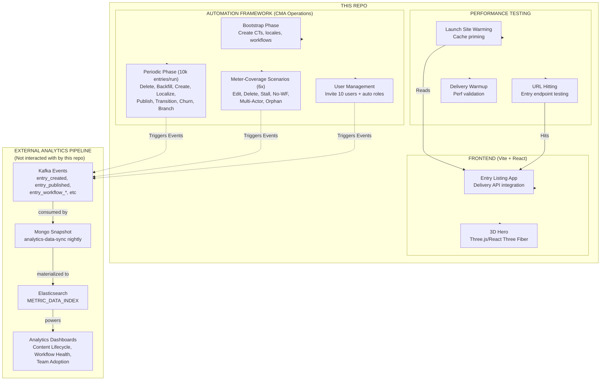
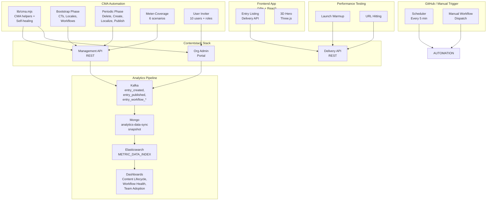
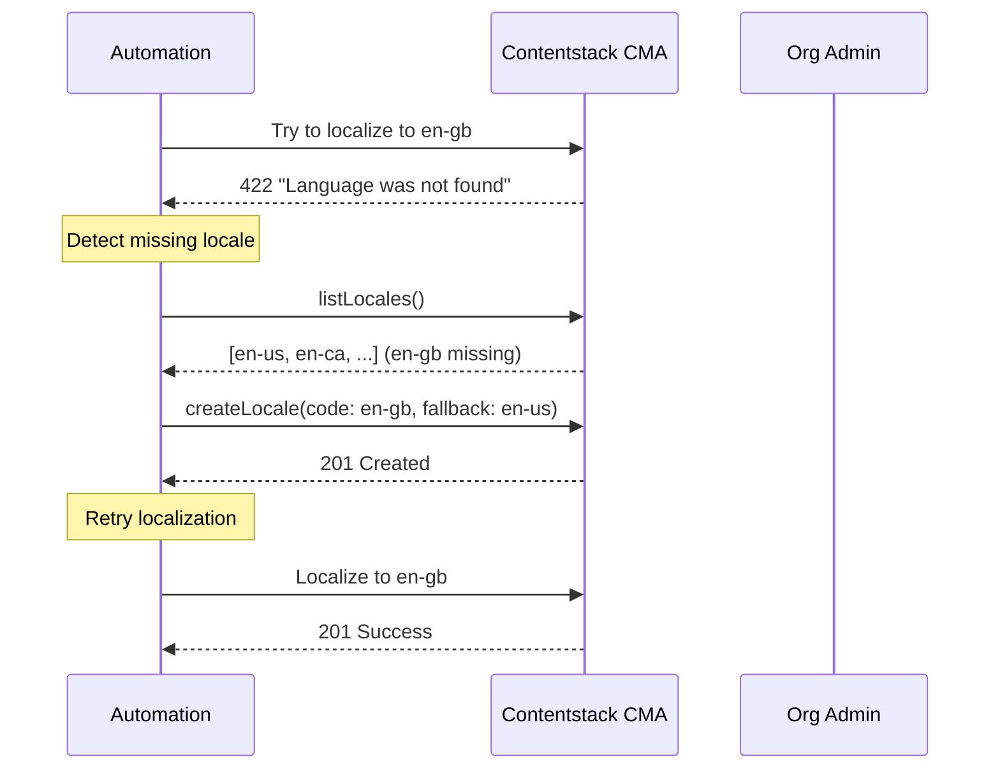

# Contentstack Analytics Testing & Automation Lab

**Comprehensive platform for testing Contentstack's content delivery, analytics metering, and lifecycle automation. Combines a frontend Vite+React app, Launch site warming, URL hitting, and production-grade CMA automation framework.**

> This is a full-stack testing laboratory for Contentstack that covers the entire content lifecycle: from creation through metering to analytics validation.

**Table of Contents:**
1. [Project Overview](#project-overview)
2. [What's Included](#whats-included)
3. [Team Onboarding](#team-onboarding)
4. [Architecture](#architecture)
5. [Frontend App: Entry Listing](#frontend-app--entry-listing)
6. [Launch Site & URL Hitting](#launch-site--url-hitting)
7. [Automation Framework: CMA Lifecycle](#automation-framework--cma-lifecycle)
8. [Self-Healing Logic](#self-healing-logic)
9. [Complete Configuration Reference](#complete-configuration-reference)
10. [Running Everything](#running-everything)
11. [Monitoring & Analytics](#monitoring--analytics)
12. [CI/CD Integration](#cicd-integration)
13. [All Scripts Reference](#all-scripts-reference)
14. [Low-Level Design & Algorithms](#low-level-design--algorithms)
15. [Troubleshooting](#troubleshooting)

---

## Project Overview

### Purpose

This project is a **full-stack testing and automation laboratory** for Contentstack that:
- **Tests Content Delivery:** Published entries served via Delivery API (frontend app)
- **Tests Performance:** Launch site warmup and URL hitting for cache/perf testing
- **Generates Meter Events:** CMA operations that create the events and data needed for analytics metering
- **Covers All Meter Dimensions:** Entry creation, publishing, workflow transitions, deletions across all combinations (users, branches, locales, workflows, stages)
- **Simulates Realistic Lifecycle:** Aged entries, branching, multi-user scenarios, orphaning, soft/hard deletions

### The Problem

Analytics dashboards (CMS Content Lifecycle, Workflow Health, Team Adoption) depend on accurate meter events from Contentstack CMA operations. Current testing is shallow:
- ❌ Only fresh entries (no aged data)
- ❌ Single user (no multi-user dimensions)
- ❌ No branching (no lineage events)
- ❌ No deletions (no deletion metering)
- ❌ No orphaning scenarios (no cleanup validation)
- ❌ Manual setup required (content types, locales, workflows)

### The Solution

Three integrated components:

1. **Frontend App** — Vite + React that displays published entries from the Delivery API
2. **Launch Site + URL Hitting** — Warms cache, tests delivery perf, exercises Delivery API at scale
3. **Automation Framework** — CMA lifecycle automation that drives all meter dimensions, self-heals missing prerequisites, maintains aged dataset

Together, they create a **production-grade testing environment** that runs continuously (every 5 minutes in CI) to generate the comprehensive meter events and data that feed downstream analytics systems.

---

## What's Included



---

## Team Onboarding

### For Frontend Developers

**Goal:** Understand how the React app uses Contentstack Delivery API to list and display published entries.

**Quick Start:**
```bash
# 1. Copy env template
cp .env.example .env

# 2. Fill in Delivery API credentials (see "Frontend Setup" section)
VITE_CONTENTSTACK_API_KEY=your_api_key
VITE_CONTENTSTACK_DELIVERY_TOKEN=your_token
VITE_CONTENTSTACK_ENVIRONMENT=production
VITE_CONTENTSTACK_DELIVERY_HOST=https://cdn.contentstack.io

# 3. Start dev server
npm install
npm run dev

# 4. Open http://localhost:5173
# You'll see published entries with 3D hero
```

**Key Files:**
- `src/pages/EntryPage.jsx` — Single entry display via route `/entry/:contentTypeUid/:entryUid`
- `src/App.jsx` — Entry list (all published entries from all CTs)
- `src/components/Hero.jsx` — Three.js 3D scene using React Three Fiber
- `vite.config.js` — Vite + React setup

**Environment Variables (Frontend):**
| Variable | Purpose |
|----------|---------|
| `VITE_CONTENTSTACK_API_KEY` | Stack API key |
| `VITE_CONTENTSTACK_DELIVERY_TOKEN` | Delivery API token (read-only) |
| `VITE_CONTENTSTACK_ENVIRONMENT` | Target environment uid |
| `VITE_CONTENTSTACK_DELIVERY_HOST` | CDN URL (e.g., `https://cdn.contentstack.io`) |
| `VITE_CONTENTSTACK_CONTENT_TYPE_UIDS` | (Optional) CSV of CTs to list; defaults to `top_url_lines` |

---

### For QA/Performance Engineers

**Goal:** Understand how to warm the launch site and hit URLs for performance testing.

**Quick Start:**
```bash
# 1. Set env vars (DELIVERY_* + APP URLs)
export VITE_CONTENTSTACK_CONTENT_TYPE_UIDS=demo_plain_text,demo_json_rte
export LAUNCH_SITE_URL=https://yoursite.com
export APP_DELIVERY_HOST=https://cdn.contentstack.io

# 2. Run warmup
npm run warm:launch-urls

# 3. Monitor performance (check logs, cache headers)
```

**Scripts:**
- `npm run warm:launch-urls` — Warms Launch site + Delivery endpoints
- Results logged to console + `public/warmup-report.json`

**What It Tests:**
- Delivery API response time
- Cache hit/miss headers
- Entry list endpoint
- Single-entry endpoint `/entry/:ct/:uid`

---

### For Automation Engineers

**Goal:** Understand the CMA automation framework, how it drives meter events, and how self-healing works.

**Quick Start:**
```bash
# 1. Set env vars (all CMA + automation vars, see Config section)
cp .env.example .env
# Fill in: CONTENTSTACK_API_KEY, CONTENTSTACK_MANAGEMENT_TOKEN, CONTENTSTACK_USER_EMAIL, etc.

# 2. Bootstrap (one-time: create CTs, locales, workflows, branches)
node --env-file=.env scripts/drive-all.mjs --mode bootstrap

# 3. Run periodic (10k entries, all meter coverage)
node --env-file=.env scripts/drive-all.mjs --mode periodic

# 4. Monitor dashboard
# Open http://localhost:5173/runs (shows KPIs, success rate, trends)
```

**Key Concepts:**
- **Self-healing:** Automation auto-creates missing locales, workflows, user roles (no manual setup)
- **Meter coverage:** 6 scenarios (edit-after-publish, permanent-deletes, aged-stalls, no-workflow-ct, multi-actor, branch-locale-deletion)
- **Data preservation:** No teardown — aged data kept for analytics (tiered retention with backfill)
- **Volume:** 10,000 entries/run × 5 locales × 5 content types = 250,000 creation events/run

**Key Files:**
- `scripts/drive-all.mjs` — Orchestrator (bootstrap/periodic/full modes)
- `scripts/lib/cma.mjs` — CMA helpers + self-healing logic
- `scripts/` — 19 specialized scripts (delete, backfill, create, localize, etc.)

---

### For Analytics/Data Engineers

**Goal:** Understand what meter events and data this automation generates for downstream analytics systems.

**Key Points:**
- Automation creates realistic content patterns (branching, locales, workflows, aging, orphaning)
- Every CMA operation triggers events that go to Kafka (entry_created, entry_published, entry_workflow_*, etc.)
- This repo generates comprehensive meter-relevant operations; downstream systems (analytics-data-sync, ES) consume and process them
- We ensure all meter dimensions are covered; downstream dashboards (CMS Content Lifecycle, Workflow Health, Team Adoption) are fed by this data

**Meter Coverage (What Gets Tested):**
| Meter | Dimension | Driver | Tested |
|-------|-----------|--------|--------|
| entries_created | locale | Localize to 5 non-master locales | ✅ 5 locales × 10k |
| entries_created | content_type | Create across all CTs | ✅ All CTs |
| entries_created | branch | Create on 30-branch lineage | ✅ Lineage |
| entries_published | user_uid | Multi-actor (creator ≠ publisher) | ✅ 2 users |
| entries_in_progress | — | Publish then edit (no republish) | ✅ Scenario |
| entries_deleted | — | Hard delete (not soft) | ✅ Scenario |
| entries_without_workflow | — | Create on bare CT (no workflow) | ✅ Scenario |
| stalled_by_stage | workflow_uid | Entries stuck in mid-stages | ✅ 5+ stages |
| snapshot (branch axis) | branch_uid | Lineage branch delete | ✅ Orphan |
| snapshot (locale axis) | locale_code | Locale delete post-stage | ✅ Orphan |
| org_users | — | Invite 10 users + assign roles | ✅ 10/run |

**Verification:**
- Check `public/run-history.json` for per-run KPIs
- Monitor dashboard at `/runs` for trends
- Verify CMA operations succeeded via run-history.json success rate
- Confirm all meter dimensions were covered in the latest run

---

### For DevOps/Infrastructure

**Goal:** Deploy automation to CI, manage secrets, monitor health.

**CI Setup (GitHub Actions):**
```yaml
name: Periodic Automation
on:
  schedule:
    - cron: '*/5 * * * *'  # Every 5 minutes
  workflow_dispatch:

jobs:
  periodic:
    runs-on: ubuntu-latest
    steps:
      - uses: actions/checkout@v4
      - uses: actions/setup-node@v4
        with:
          node-version: 24
      - run: npm ci
      - run: npm run automate:drive:ci -- --mode periodic
        env:
          CONTENTSTACK_API_KEY: ${{ secrets.CONTENTSTACK_API_KEY }}
          CONTENTSTACK_MANAGEMENT_TOKEN: ${{ secrets.CONTENTSTACK_MANAGEMENT_TOKEN }}
          CONTENTSTACK_PUBLISH_ENVIRONMENT: production
          CONTENTSTACK_USER_EMAIL: ${{ secrets.CONTENTSTACK_USER_EMAIL }}
          CONTENTSTACK_USER_PASSWORD: ${{ secrets.CONTENTSTACK_USER_PASSWORD }}
```

**Secrets to Set (GitHub → Settings → Secrets and variables → Actions):**
- `CONTENTSTACK_API_KEY`
- `CONTENTSTACK_MANAGEMENT_TOKEN`
- `CONTENTSTACK_USER_EMAIL`
- `CONTENTSTACK_USER_PASSWORD`
- `CONTENTSTACK_PUBLISH_ENVIRONMENT`

**Monitoring:**
- Dashboard at `/runs` shows 95%+ success rate, KPI trends
- Run history appended to `public/run-history.json`
- Alert if > 5% step failures in rolling 24h window

---

## Architecture

### System Architecture



### Periodic Workflow

```mermaid
graph TD
    START["Start Periodic Run<br/>10k entries planned"]
    
    DEL["1. Delete Old Entries<br/>Tiered Retention<br/>3 age bands"]
    BACK["2. Backfill from Trash<br/>Restore if below target<br/>Preserves created_at"]
    
    CREATE["3. Create 10k Entries<br/>Split across CTs<br/>Concurrency: 12<br/>Triggers: entry_created"]
    LOCALE["4. Localize Entries<br/>5 non-master locales<br/>Auto-create if missing<br/>Triggers: entry_created x5"]
    
    PUBLISH["5. Publish/Unpublish<br/>60% / 15% ratio<br/>Batch: 100<br/>Triggers: entry_published"]
    TRANS["6. Workflow Transitions<br/>5 patterns (linear, skip,<br/>rework, stall, firstOnly)<br/>Triggers: entry_workflow_*"]
    
    CHURN["7. Churn Orphan Cases<br/>Disable, Detach, Branch,<br/>Locale, $all, Restore"]
    BRANCH["8. Branch Lifecycle<br/>30-branch lineage<br/>Dynamic CTs<br/>Multi-branch publish"]
    
    METER["9. Meter-Coverage (6x)<br/>- Edit-after-publish<br/>- Permanent-deletes<br/>- Aged-stalls<br/>- No-workflow-ct<br/>- Multi-actor<br/>- Branch-locale-deletion"]
    
    INVITE["10. Invite Users<br/>10 new users<br/>Playwright UI automation<br/>Auto-assign CMS roles"]
    
    REPORT["11. Report KPIs<br/>Append run-history.json<br/>Update dashboard /runs"]
    
    END["End<br/>~25 min total"]
    
    START --> DEL
    DEL --> BACK
    BACK --> CREATE
    CREATE --> LOCALE
    LOCALE --> PUBLISH
    PUBLISH --> TRANS
    TRANS --> CHURN
    CHURN --> BRANCH
    BRANCH --> METER
    METER --> INVITE
    INVITE --> REPORT
    REPORT --> END
```



---

## Frontend App & Entry Listing

### What It Does

The frontend is a **Vite + React web app** that:
1. Fetches published entries from the Contentstack **Delivery API** (read-only)
2. Lists all entries across specified content types
3. Displays individual entries at `/entry/:contentTypeUid/:entryUid`
4. Renders a 3D hero using **Three.js** via React Three Fiber

### Why It Matters

- Tests **Delivery API integration** (read path, not write)
- Validates **published entries** (only published entries appear)
- Exercises **entry rendering** at scale (1000s of entries)
- Foundation for **Launch site warmup** and **URL hitting** performance tests

### Setup

```bash
# 1. Copy environment template
cp .env.example .env

# 2. Fill in Delivery API credentials
VITE_CONTENTSTACK_API_KEY=your_stack_api_key
VITE_CONTENTSTACK_DELIVERY_TOKEN=your_delivery_token
VITE_CONTENTSTACK_ENVIRONMENT=production
VITE_CONTENTSTACK_DELIVERY_HOST=https://cdn.contentstack.io
VITE_CONTENTSTACK_CONTENT_TYPE_UIDS=demo_plain_text,demo_json_rte,demo_reference

# 3. Install and run dev server
npm install
npm run dev

# 4. Open http://localhost:5173
```

### Key Routes

| Route | Purpose |
|-------|---------|
| `/` | Home page (lists all published entries) |
| `/entry/:contentTypeUid/:entryUid` | Single entry display |
| `/runs` | Automation dashboard (KPIs, success rate, trends) |

### Environment Variables (Frontend)

```
VITE_CONTENTSTACK_API_KEY              # Stack API key
VITE_CONTENTSTACK_DELIVERY_TOKEN       # Delivery API read-only token
VITE_CONTENTSTACK_ENVIRONMENT          # Environment uid (e.g., production)
VITE_CONTENTSTACK_DELIVERY_HOST        # CDN URL (https://cdn.contentstack.io)
VITE_CONTENTSTACK_CONTENT_TYPE_UIDS    # (Optional) CSV of CTs to list
```

### Build for Production

```bash
npm run build      # Outputs to dist/
npm run preview    # Preview build locally
```

---

## Launch Site & URL Hitting

### What It Does

Warms the **Delivery API cache** and tests **entry endpoint performance** by:
1. Fetching the Launch site (primes CDN cache)
2. Hitting entry list endpoint 100x (tests concurrent delivery)
3. Hitting single-entry endpoints 100x (tests endpoint perf)
4. Logging response times, cache status (hit/miss)

### Why It Matters

- Validates **Delivery API performance** under load
- Tests **cache behavior** (CDN, edge, origin)
- Provides a **baseline** for perf regression detection
- Part of the **continuous validation** loop (runs after each automation run)

### Setup

```bash
# Environment variables needed
export LAUNCH_SITE_URL=https://your-launch-site.com
export VITE_CONTENTSTACK_DELIVERY_HOST=https://cdn.contentstack.io
export VITE_CONTENTSTACK_CONTENT_TYPE_UIDS=demo_plain_text

# Run warmup
npm run warm:launch-urls

# Results logged to console + public/warmup-report.json
```

### What Gets Tested

```
GET /entry/:contentTypeUid (list endpoint)
  ├─ 100 concurrent fetches
  └─ Logs: response time, cache header, status

GET /entry/:contentTypeUid/:entryUid (single-entry endpoint)
  ├─ 100 concurrent fetches
  └─ Logs: response time, cache header, status

GET https://launch-site (Launch site)
  └─ Logs: response time, status
```

### Reports

- **Console:** Real-time request counts, response codes
- **public/warmup-report.json:** Aggregated stats (avg time, cache hits, failures)

---

## Automation Framework: CMA Lifecycle

### Overview

The **Contentstack Metering Automation Framework** is the core of this project. It:
1. **Creates realistic content patterns** (10,000 entries/run, 30-branch lineage, 5 locales)
2. **Drives all meter dimensions** (entry events, user events, branch events, workflow events)
3. **Self-heals missing prerequisites** (auto-creates locales, workflows, user roles)
4. **Maintains aged dataset** (tiered retention + backfill from trash)
5. **Runs every 5 minutes in CI** (continuous validation of analytics pipelines)

### 19 Scripts Overview

#### Bootstrap Phase (One-Time Setup)

| Script | Purpose |
|--------|---------|
| `bootstrap-from-manifest.mjs` | Create content types from manifest |
| `seed-locales-branches.mjs` | Create locales (with fallback chains) + branches |
| `seed-workflows.mjs` | Create 3 workflows with stages |
| `seed-publishing-rules.mjs` | Create publishing rules for workflows |

#### Periodic Phase (Every 5 Minutes)

| Script | Purpose | Events Fired |
|--------|---------|--------------|
| `delete-old-entries.mjs` | Tiered retention (3 age bands, keep targets) | — |
| `backfill-aged-entries.mjs` | Restore from trash if below targets | — |
| `periodic-entries-from-manifest.mjs` | Create 10,000 entries across CTs | `entry_created` x 10k |
| `localize-entries.mjs` | Localize to 5 non-master locales | `entry_created` x 50k |
| `bulk-publish-cycle.mjs` | Publish 60% / unpublish 15% | `entry_published` x 6k |
| `seed-workflows.mjs` | Transition entries through 5 patterns | `entry_workflow_*` x 2k |
| `churn-orphans.mjs` | Edge cases (disable, detach, restore) | Various meter events |
| `branch-lifecycle.mjs` | 30-branch lineage + dynamic CTs | Branch-related events |

#### Meter-Coverage Scenarios (6x)

| Script | Purpose | Meter Dimension |
|--------|---------|-----------------|
| `edit-after-publish.mjs` | Publish then edit without republish | `entries_in_progress` |
| `permanent-deletes.mjs` | Hard delete entries (not soft) | `entries_deleted` |
| `aged-stalls.mjs` | Entries stuck in mid-stages for 8+ days | `stalled_by_stage` |
| `no-workflow-ct.mjs` | Create entries on bare CT (no workflow) | `entries_without_workflow` |
| `multi-actor-create-publish.mjs` | Different creator/publisher | `entries_published.user_uid` |
| `branch-locale-deletion.mjs` | Delete branch/locale after staging | Snapshot orphan axes |

#### User Management

| Script | Purpose |
|--------|---------|
| `invite-users.mjs` | Invite 10 new users via Playwright + auto-assign CMS roles |

---

## Self-Healing Logic

### Auto-Creation When Prerequisites Missing

The automation **self-heals** by automatically creating missing prerequisites:



### Healing Scenarios

| Scenario | Auto-Healing | Result |
|----------|--------------|--------|
| Locale missing | Create locale with fallback chain | Localization succeeds |
| Workflow missing | Create workflow with default stages (Draft → Review → Approved) | Transitions work |
| User has no CMS role | Assign role via `shareStack()` API | User can publish/transition |
| Content type missing | Create from manifest schema | Entries created |
| No trashed entries | Skip backfill (no error) | Graceful degradation |

### Key Principle

**Every failure point has a self-healing path.** If a prerequisite is missing, the automation creates it automatically instead of failing. This eliminates manual setup and allows the automation to work on any Contentstack stack.

---

## Complete Configuration Reference

### Environment Variables (All)

#### Frontend (VITE_*)

```bash
VITE_CONTENTSTACK_API_KEY              # Stack API key (required)
VITE_CONTENTSTACK_DELIVERY_TOKEN       # Delivery API token (required)
VITE_CONTENTSTACK_ENVIRONMENT          # Environment uid (required)
VITE_CONTENTSTACK_DELIVERY_HOST        # CDN URL (required)
VITE_CONTENTSTACK_CONTENT_TYPE_UIDS    # CSV of CTs to list (optional; defaults to top_url_lines)
```

#### Automation (CONTENTSTACK_*)

**Required:**
```bash
CONTENTSTACK_API_KEY                   # Stack API key
CONTENTSTACK_MANAGEMENT_TOKEN          # CMA management token
CONTENTSTACK_PUBLISH_ENVIRONMENT       # Target environment for publish
CONTENTSTACK_USER_EMAIL                # User email for transitions/publishing/UI
CONTENTSTACK_USER_PASSWORD             # User password (2FA-capable)
```

**Retention Policies (Defaults):**
```bash
CONTENTSTACK_RETENTION_TARGET_OVER_30D=5000      # Keep 5k entries > 30 days old
CONTENTSTACK_RETENTION_TARGET_15_30D=10000       # Keep 10k entries 15-30 days old
CONTENTSTACK_RETENTION_TARGET_7_15D=20000        # Keep 20k entries 7-15 days old
```

**Concurrency & Volume (Defaults):**
```bash
CONTENTSTACK_PERIODIC_CONCURRENCY=12             # Parallel entry creates
CONTENTSTACK_DELETE_CONCURRENCY=10               # Parallel deletes
CONTENTSTACK_BRANCH_LINEAGE_COUNT=30             # Branches in lineage
CONTENTSTACK_BRANCH_ENTRIES_PER_CT=50            # Entries per branch
CONTENTSTACK_INVITE_COUNT=10                     # Users to invite per run
CONTENTSTACK_BRANCH_CHURN_PERCENTAGE=0.2         # Disable/detach as % (not delete)
```

**Publish Ratios (Defaults):**
```bash
CONTENTSTACK_PUBLISH_RATIO=0.6                   # 60% of created entries to publish
CONTENTSTACK_UNPUBLISH_RATIO=0.15                # 15% to unpublish
```

**Optional:**
```bash
CONTENTSTACK_MANAGEMENT_HOST=https://api.contentstack.io   # CMA host
CONTENTSTACK_BRANCH=main                                    # Branch to use
CONTENTSTACK_LOCALE=en-us                                   # Master locale
```

### Quick Setup Script

```bash
cat > .env << 'EOF'
# Frontend
VITE_CONTENTSTACK_API_KEY=your_api_key
VITE_CONTENTSTACK_DELIVERY_TOKEN=your_delivery_token
VITE_CONTENTSTACK_ENVIRONMENT=production
VITE_CONTENTSTACK_DELIVERY_HOST=https://cdn.contentstack.io

# Automation
CONTENTSTACK_API_KEY=your_api_key
CONTENTSTACK_MANAGEMENT_TOKEN=your_mgmt_token
CONTENTSTACK_PUBLISH_ENVIRONMENT=production
CONTENTSTACK_USER_EMAIL=user@example.com
CONTENTSTACK_USER_PASSWORD=password

# Retention (optional - uses defaults if not set)
CONTENTSTACK_RETENTION_TARGET_OVER_30D=5000
CONTENTSTACK_RETENTION_TARGET_15_30D=10000
CONTENTSTACK_RETENTION_TARGET_7_15D=20000

# Concurrency (optional - uses defaults if not set)
CONTENTSTACK_PERIODIC_CONCURRENCY=12
CONTENTSTACK_BRANCH_LINEAGE_COUNT=30
CONTENTSTACK_INVITE_COUNT=10
EOF
```

---

## Running Everything

### Frontend App

```bash
# Development
npm install
npm run dev              # http://localhost:5173

# Production build
npm run build            # Outputs to dist/
npm run preview          # Preview build

# Linting
npm run lint
```

### Launch Site Warmup

```bash
# Warm Delivery API and entry endpoints
npm run warm:launch-urls

# Logs to console + public/warmup-report.json
```

### Automation Framework

```bash
# BOOTSTRAP (one-time: creates CTs, locales, workflows, branches)
node --env-file=.env scripts/drive-all.mjs --mode bootstrap

# PERIODIC (every 5 min: full lifecycle, 10k entries, all meter coverage)
node --env-file=.env scripts/drive-all.mjs --mode periodic

# FULL (bootstrap + periodic in one go)
node --env-file=.env scripts/drive-all.mjs --mode full

# DRY-RUN (preview what would happen)
node --env-file=.env scripts/drive-all.mjs --mode periodic --dry-run
```

### Performance Targets

| Phase | Volume | Concurrency | Duration |
|-------|--------|-------------|----------|
| Create entries | 10,000 | 12 | ~5 min |
| Localize | 50,000 (5 locales) | 6 | ~8 min |
| Publish | 6,000 | 10 | ~3 min |
| Delete | 6,000 | 10 | ~3 min |
| Transitions | 2,000 | 8 | ~2 min |
| **Periodic run total** | — | — | **~25 min** |

---

## Monitoring & Analytics

### Dashboard

After the first automation run, a dashboard appears at **http://localhost:5173/runs** showing:

**Reliability:**
- Success rate (aim: 95%+)
- Green streaks (consecutive successful runs)
- p95 run duration

**Entries Lifecycle:**
- Created, deleted, localized counts
- Per-age-band retention targets
- Net entry growth

**Meter Coverage:**
- Per-scenario KPI tracking (edit-after-publish, permanent-deletes, aged-stalls, etc.)
- Dimension coverage matrix

**Errors & Gaps:**
- Failure log with root cause
- Missing dimensions
- Step-by-step failure tracking

### Run History

KPIs appended to `public/run-history.json` after each run:
- Timestamp, mode (bootstrap/periodic/full)
- Per-step planned/actual/failed counts
- Aggregated KPIs
- Error audit log

---

## CI/CD Integration

### GitHub Actions Workflow

Schedule automation to run every 5 minutes:

```yaml
name: Periodic Automation

on:
  schedule:
    - cron: '*/5 * * * *'  # Every 5 minutes
  workflow_dispatch:        # Manual trigger

jobs:
  periodic:
    runs-on: ubuntu-latest
    steps:
      - uses: actions/checkout@v4
      - uses: actions/setup-node@v4
        with:
          node-version: 24
      
      - run: npm ci
      - run: npm run automate:drive:ci -- --mode periodic
        env:
          CONTENTSTACK_API_KEY: ${{ secrets.CONTENTSTACK_API_KEY }}
          CONTENTSTACK_MANAGEMENT_TOKEN: ${{ secrets.CONTENTSTACK_MANAGEMENT_TOKEN }}
          CONTENTSTACK_PUBLISH_ENVIRONMENT: production
          CONTENTSTACK_USER_EMAIL: ${{ secrets.CONTENTSTACK_USER_EMAIL }}
          CONTENTSTACK_USER_PASSWORD: ${{ secrets.CONTENTSTACK_USER_PASSWORD }}
```

### Setting Up Secrets

On GitHub → Settings → Secrets and variables → Actions, add:
- `CONTENTSTACK_API_KEY`
- `CONTENTSTACK_MANAGEMENT_TOKEN`
- `CONTENTSTACK_PUBLISH_ENVIRONMENT`
- `CONTENTSTACK_USER_EMAIL`
- `CONTENTSTACK_USER_PASSWORD`

---

## All Scripts Reference

### Bootstrap Phase

#### bootstrap-from-manifest.mjs
Creates content types from `scripts/content-types.manifest.json`.
```bash
node --env-file=.env scripts/bootstrap-from-manifest.mjs
```
**Creates:** All content types, with schema from manifest
**Output:** CT count, creation times

#### seed-locales-branches.mjs
Creates locales with fallback chains + branches.
```bash
node --env-file=.env scripts/seed-locales-branches.mjs
```
**Creates:** 5 locales (en-gb→en-us, fr-fr→en-us, fr-ca→fr-fr, de-de→en-us, de-at→de-de) + 3 branches
**Output:** Locale codes, branch UIDs

#### seed-workflows.mjs
Creates 3 workflows with stages: Editorial Review, Marketing Approval, Quick Publish.
```bash
node --env-file=.env scripts/seed-workflows.mjs
```
**Creates:** 3 workflows, stages, publishing permissions
**Output:** Workflow UIDs, stage counts

#### seed-publishing-rules.mjs
Creates publishing rules for workflows across all content types.
```bash
node --env-file=.env scripts/seed-publishing-rules.mjs
```
**Creates:** Publishing rules for each workflow-stage-CT combo
**Output:** Rule count, stage mappings

---

### Periodic Phase

#### delete-old-entries.mjs
Tiered retention: deletes oldest excess in each age band.
```bash
node --env-file=.env scripts/delete-old-entries.mjs
```
**Targets:** >30d (keep 5k), 15-30d (keep 10k), 7-15d (keep 20k)
**Output:** Deletions per band, total deleted

#### backfill-aged-entries.mjs
Restores from trash if entry count in any band falls below target.
```bash
node --env-file=.env scripts/backfill-aged-entries.mjs
```
**Targets:** Restore to target counts if below threshold
**Output:** Restored count per band, preserved created_at

#### periodic-entries-from-manifest.mjs
Creates 10,000 entries across all content types (concurrent creation).
```bash
node --env-file=.env scripts/periodic-entries-from-manifest.mjs
```
**Creates:** ~10k entries (split evenly across CTs)
**Concurrency:** 12 parallel creates
**Output:** Created count per CT, total, failures

#### localize-entries.mjs
Localizes newest entries to 5 non-master locales (auto-creates missing locales).
```bash
node --env-file=.env scripts/localize-entries.mjs
```
**Targets:** 5 locales, auto-create if missing
**Output:** Localized count per locale, failures

#### bulk-publish-cycle.mjs
Publishes 60% / unpublishes 15% of created entries.
```bash
node --env-file=.env scripts/bulk-publish-cycle.mjs
```
**Ratios:** 60% publish, 15% unpublish
**Output:** Published, unpublished counts

#### seed-workflows.mjs (Periodic Run)
Transitions entries through 5 workflow patterns (linear, skip, rework, stall, firstOnly).
```bash
node --env-file=.env scripts/seed-workflows.mjs
```
**Patterns:** 5 (each with weighted distribution)
**Output:** Transitions per pattern, total transitioned

#### churn-orphans.mjs
Edge cases: disable/detach workflows, branch/locale operations, entry restore.
```bash
node --env-file=.env scripts/churn-orphans.mjs
```
**Operations:** Disable, detach, branch create/delete, locale delete, restore
**Output:** Operation counts per type, success rates

#### branch-lifecycle.mjs
30-branch lineage with dynamic content types, multi-branch publish rules.
```bash
node --env-file=.env scripts/branch-lifecycle.mjs
```
**Lineage:** 30 branches (bl-{timestamp}-1 through -30), inherited from previous
**Dynamic CTs:** 10 per run
**Output:** Branch count, entries per branch, CT+rule counts

---

### Meter-Coverage Scenarios

#### edit-after-publish.mjs
Publish entry, then edit without republishing → drives `entries_in_progress`.
```bash
node --env-file=.env scripts/edit-after-publish.mjs
```
**Meter:** entries_in_progress dimension
**Output:** Published count, edited-in-place count

#### permanent-deletes.mjs
Hard delete entries (not soft) → drives `entries_deleted`.
```bash
node --env-file=.env scripts/permanent-deletes.mjs
```
**Meter:** entries_deleted dimension
**Output:** Created count, deleted count

#### aged-stalls.mjs
Create entries, transition to mid-stages, leave stalled → drives `stalled_by_stage`.
```bash
node --env-file=.env scripts/aged-stalls.mjs
```
**Meter:** stalled_by_stage dimension (entries stuck in non-terminal stages)
**Output:** Created count, stalled count per stage

#### no-workflow-ct.mjs
Create entries on content type with NO workflow → drives `entries_without_workflow`.
```bash
node --env-file=.env scripts/no-workflow-ct.mjs
```
**Meter:** entries_without_workflow dimension
**Output:** CT created, entries created (no workflow transitions)

#### multi-actor-create-publish.mjs
Actor A creates entries, Actor B publishes → distinct `entries_published.user_uid`.
```bash
node --env-file=.env scripts/multi-actor-create-publish.mjs
```
**Meter:** entries_published.user_uid dimension (creator ≠ publisher)
**Output:** Created count (actor A), published count (actor B), distinct user count

#### branch-locale-deletion.mjs
Stage entries on feature branch/non-default locale, delete → snapshot orphan axes.
```bash
node --env-file=.env scripts/branch-locale-deletion.mjs
```
**Meter:** Snapshot branch_uid and locale_code axes (orphan-drop validation)
**Output:** Branch deleted count, locale deleted count, orphaned entries

---

### User Management

#### invite-users.mjs
Invite 10 new users via Playwright + auto-assign CMS roles.
```bash
node --env-file=.env scripts/invite-users.mjs
```
**Users:** 10 new invitations per run (unique emails)
**Roles:** Auto-assigned CMS role (Developer/Contributor)
**Output:** Invited count, role-assigned count, failures

---

## Low-Level Design & Algorithms

### Entry Creation with Concurrency

```javascript
CREATE_ENTRIES(concurrency = 12) {
  pool = createWorkerPool(concurrency)
  for (ct in contentTypes) {
    entries_to_create = CONTENTSTACK_PERIODIC_TOTAL / len(contentTypes)
    
    while (entries_to_create > 0) {
      batch = entries_to_create.slice(0, concurrency)
      
      for (entry in batch) parallel {
        title = generate_unique_title()
        fields = resolve_placeholders(fields)
        
        result = POST /v3/content_types/{ct}/entries {
          entry: { title, ...fields }
        }
        
        if result.ok {
          kpis.created++
        } else if result.error == 133 { // org entry cap
          kpis.capHit++
          stop_creation()
        } else {
          kpis.failed++
        }
      }
      
      entries_to_create -= batch.length
      sleep(100ms) // brief pause before next batch
    }
  }
  
  report(kpis)
}
```

### Tiered Retention Algorithm

```javascript
TIERED_RETENTION() {
  now = Date.now()
  
  bands = [
    { name: ">30d",   min_age: 30*day,  max_age: ∞,       keep: 5000  },
    { name: "15-30d", min_age: 15*day,  max_age: 30*day,  keep: 10000 },
    { name: "7-15d",  min_age: 7*day,   max_age: 15*day,  keep: 20000 },
  ]
  
  for (ct in contentTypes) {
    for (band in bands) {
      entries = GET /entries {
        query: {
          created_at: {
            $gte: now - band.max_age,
            $lt:  now - band.min_age
          }
        },
        include_count: true
      }
      
      count = entries.length
      excess = max(0, count - band.keep)
      
      if excess > 0 {
        to_delete = entries.sort_by(created_at).slice(0, excess)
        
        for (entry in to_delete) parallel {
          DELETE /entries/{uid}
          kpis.deleted++
          kpis.bands[band.name]++
        }
      }
    }
  }
  
  report(kpis)
}
```

### Backfill from Trash

```javascript
BACKFILL_AGED_ENTRIES() {
  now = Date.now()
  
  bands = [
    { name: ">30d",   start_age: 30*day,  end_age: 100*day, target: 5000  },
    { name: "15-30d", start_age: 15*day,  end_age: 30*day,  target: 10000 },
    { name: "7-15d",  start_age: 7*day,   end_age: 15*day,  target: 20000 },
  ]
  
  for (band in bands) {
    trashed = GET /entries {
      query: {
        created_at: {
          $gte: now - band.end_age,
          $lt:  now - band.start_age
        },
        _metadata: { deleted_at: { $exists: true } }
      }
    }
    
    count = trashed.length
    deficit = max(0, band.target - count)
    
    if deficit == 0 {
      continue // band is full
    }
    
    to_restore = trashed.slice(0, deficit)
    
    for (entry in to_restore) parallel {
      result = PUT /entries/{uid}/restore {
        entry: { locale }
      }
      
      if result.ok {
        kpis.restored++
      }
    }
  }
  
  report(kpis)
}
```

### Workflow Transition with 5 Patterns

```javascript
WORKFLOW_TRANSITIONS(rng_seed) {
  rng = mulberry32(rng_seed) // deterministic
  
  patterns = {
    linear:      [0, 1, 2],           // Draft → Review → Approved
    skip:        [0, 2],              // Draft → Approved (skip Review)
    rework:      [0, 1, 0, 1, 2],    // Draft → Review → Draft → Review → Approved
    partialStall: [0, 1],             // Draft → Review (stuck)
    firstOnly:   [0],                 // Draft only (no transition)
  }
  
  weights = DEFAULT_PATTERN_WEIGHTS // {linear: 0.3, skip: 0.1, ...}
  
  for (entry in entries) {
    pattern = pick_weighted(patterns, weights, rng)
    stops = pattern.map(idx => stages[idx])
    
    for (stop in stops) {
      result = PUT /entries/{uid}/transition {
        _workflow: {
          workflow_uid: wf.uid,
          stage_uid: stop.uid,
          assigned_to: [user],
          comment: `auto:${pattern}:${stop.name}`
        }
      }
      
      if result.ok {
        kpis.transitions++
      } else if result.status == 422 {
        // transit not allowed from current stage
        kpis.transitionsSkipped++
      } else {
        kpis.failed++
      }
    }
  }
  
  report(kpis)
}
```

---

## Troubleshooting

| Error | Cause | Solution |
|-------|-------|----------|
| "Language was not found (422)" | Locale doesn't exist | Auto-created on next run |
| "Workflow not found" | Workflow doesn't exist | Auto-created on next run |
| "Access denied (401)" | User lacks CMS role | Auto-assigned on next run |
| "Entries > 7d all deleted" | Retention too aggressive | Backfill restores from trash |
| "No trashed entries" | Never created entries to delete | Graceful skip (no error) |
| "Entry cap hit (133)" | Org entry limit reached | Graceful stop, resume next run |
| "Entries > 30d deleted" | Tiered retention working as intended | Backfill restores to target |

### Debug Mode

```bash
# Dry-run (preview what would happen, no API writes)
node --env-file=.env scripts/drive-all.mjs --mode periodic --dry-run

# Check logs
tail -f public/run-history.json
cat public/warmup-report.json
```

### Performance Checklist

- ✅ Periodic runs complete in ~25 min (else tune concurrency env vars)
- ✅ Dashboard shows 95%+ success rate over rolling window
- ✅ Delivery API response times stable (check `public/warmup-report.json`)
- ✅ All 6 meter-coverage scenarios passing each run
- ✅ All meter dimensions covered (entry dimensions verified in KPIs)
- ✅ Zero manual setup required (self-healing working on missing resources)

---

## Project Structure

```
/
├── src/                        # Frontend (Vite + React)
│   ├── pages/
│   │   ├── EntryPage.jsx       # Single entry display
│   │   ├── RunsDashboard.jsx   # Automation KPIs dashboard
│   │   └── Home.jsx            # Entry listing
│   ├── components/
│   │   └── Hero.jsx            # Three.js 3D hero
│   ├── App.jsx                 # Main app
│   └── main.jsx                # Entry point
│
├── scripts/                    # Automation framework
│   ├── drive-all.mjs           # Orchestrator (bootstrap/periodic/full)
│   ├── bootstrap-from-manifest.mjs
│   ├── seed-locales-branches.mjs
│   ├── seed-workflows.mjs
│   ├── seed-publishing-rules.mjs
│   ├── delete-old-entries.mjs
│   ├── backfill-aged-entries.mjs
│   ├── periodic-entries-from-manifest.mjs
│   ├── localize-entries.mjs
│   ├── bulk-publish-cycle.mjs
│   ├── churn-orphans.mjs
│   ├── branch-lifecycle.mjs
│   ├── edit-after-publish.mjs
│   ├── permanent-deletes.mjs
│   ├── aged-stalls.mjs
│   ├── no-workflow-ct.mjs
│   ├── multi-actor-create-publish.mjs
│   ├── branch-locale-deletion.mjs
│   ├── invite-users.mjs
│   ├── warm-launch-urls.mjs
│   ├── lib/
│   │   ├── cma.mjs             # CMA helpers + self-healing
│   │   ├── progress.mjs
│   │   ├── report.mjs
│   │   ├── workflow-patterns.mjs
│   │   └── ...
│   └── manifests/
│       ├── content-types.manifest.json
│       ├── workflows.manifest.json
│       ├── locales-branches.manifest.json
│       └── publishing-rules.manifest.json
│
├── public/                     # Static + runtime outputs
│   ├── run-history.json        # Automation KPI history
│   └── warmup-report.json      # Delivery API perf report
│
├── .env.example                # Environment template
├── package.json
├── vite.config.js
└── README.md                   # This file
```

---

## License

Internal Contentstack project. See LICENSE file.

---

**Status:** Production-ready. Runs continuously in CI every 5 minutes.

