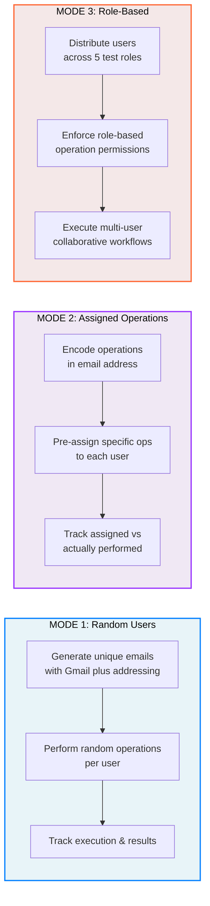
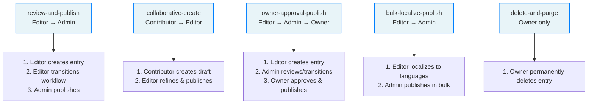
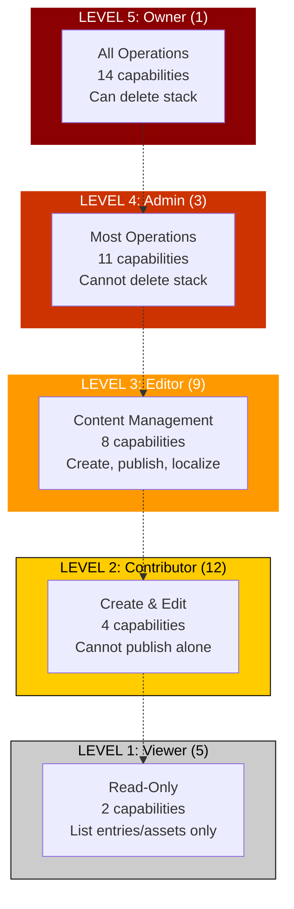
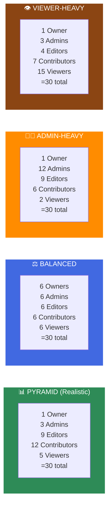
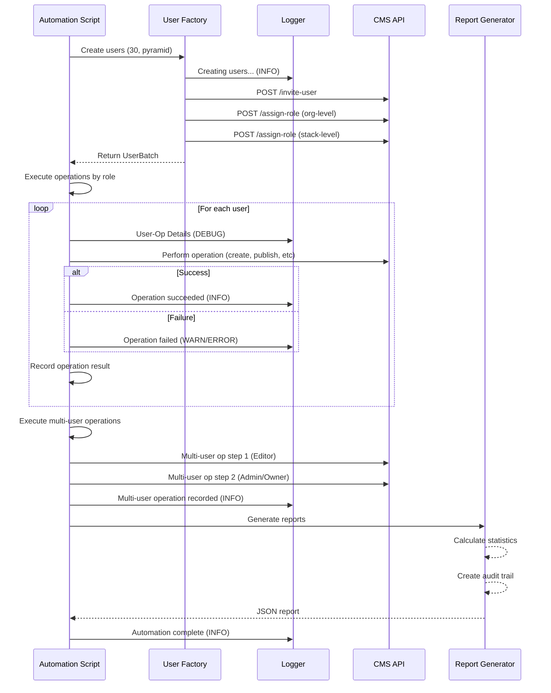

# Contentstack Analytics Automation System

Complete automation system for testing with dynamically created users, operation assignments, and role-based workflows.

---

## 🎯 Overview

This system automates testing with **unique test users created on-the-fly** using Gmail plus addressing. Each automation run creates 30+ users with:

- **Human-readable email addresses** showing run time and operations
- **Gmail plus addressing** for unlimited unique users to single inbox
- **Operation assignments** (which operations user will perform)
- **Role-based permissions** (for collaborative testing)
- **Multi-user workflows** (operations requiring multiple users)
- **Complete tracking** (audit trails, metrics, reports)

---

## ⚠️ IMPORTANT: Test Roles vs CMS Roles

### What We Built: TEST AUTOMATION ROLES
These are **simulation roles for testing purposes ONLY**:
- **Owner** → Can perform all test operations (test role only)
- **Admin** → Can perform most test operations (test role only)
- **Editor** → Can perform content operations (test role only)
- **Contributor** → Limited to create/edit (test role only)
- **Viewer** → Read-only operations (test role only)

### Real CMS Roles (Stack-Level RBAC)
Real Contentstack has different stack-level roles:
- **Developer** → Full content operations (CMS role)
- **Content Manager** → Restricted content operations (CMS role)
- **Viewer** → Read-only (CMS role)

### The Difference
```
┌─────────────────────────────────────────────────────────────────┐
│ TEST AUTOMATION ROLES (this system)                              │
│ - For simulating different user types in testing                │
│ - Created on-the-fly for test scenarios                         │
│ - Role-based operation permissions are for testing              │
│ - DO NOT map to actual CMS stack roles                          │
└─────────────────────────────────────────────────────────────────┘

┌─────────────────────────────────────────────────────────────────┐
│ CMS STACK-LEVEL ROLES (real Contentstack)                        │
│ - Developer, Content Manager, Viewer                             │
│ - Control actual API access on real stacks                       │
│ - Determined by stack sharing permissions                       │
│ - Completely independent of our test simulation roles            │
└─────────────────────────────────────────────────────────────────┘
```

**Our test users get assigned stack-level CMS roles separately** for actual API access.

---

## 🚀 Quick Start

### 1. Setup Environment

```bash
export CONTENTSTACK_TEST_USER_EMAIL=divesh.k@contentstack.com
export CONTENTSTACK_ORG_UID=your-org-uid
export CONTENTSTACK_API_KEY=your-stack-api-key
export CONTENTSTACK_MANAGEMENT_TOKEN=your-mgmt-token
```

### 2. Run Automation

```bash
# Random users (no assignments)
npm run automate:random-users

# Users with operation assignments
npm run automate:assigned-users:30

# Users with test roles
npm run automate:with-roles
```

### 3. Review Reports

```bash
ls -la step-reports/
cat step-reports/automate-with-roles.json | jq .
```

---

## 📚 Documentation

### Core Guides

1. **[RANDOM_USERS_GUIDE.md](RANDOM_USERS_GUIDE.md)** (613 lines)
   - Gmail plus addressing pattern
   - Unlimited unique users from single inbox
   - UserPool and UserIterator patterns
   - Basic automation without assignments

2. **[ASSIGNED_USERS_GUIDE.md](ASSIGNED_USERS_GUIDE.md)** (613 lines)
   - Pre-assigned operations to users
   - Human-readable dates (2025-dec-08-0230pm)
   - Operation encoding in email
   - Tracking assigned vs actual operations

3. **[ROLE_BASED_GUIDE.md](ROLE_BASED_GUIDE.md)** (524 lines)
   - **⚠️ TEST AUTOMATION ROLES ONLY** (not CMS roles)
   - Single-user operations (role-based permissions)
   - Multi-user collaborative operations
   - 4 distribution strategies (pyramid, balanced, admin-heavy, viewer-heavy)
   - Permission boundaries and escalation

### Quick References

- **Random Users**: `gmail-utils.mjs` + `user-factory.mjs`
- **Assigned Users**: `user-assignment.mjs` + `user-factory-v2.mjs`
- **Role-Based Users**: `role-based-users.mjs` + `role-based-factory.mjs`
- **Logging**: `logger.mjs`

---

## 🏗️ System Architecture

### Layered System Design

```
┌─────────────────────────────────────────────────────────────────────────────┐
│                    AUTOMATION ORCHESTRATION LAYER                            │
├─────────────────────────────────────────────────────────────────────────────┤
│ automate-with-random-users.mjs → 5-10 users, random operations             │
│ automate-with-assigned-users.mjs → 30 users with pre-assigned operations   │
│ automate-with-roles.mjs → 30 users with TEST SIMULATION ROLES              │
└─────────────────────────────────────────────────────────────────────────────┘
                                        ↓
┌─────────────────────────────────────────────────────────────────────────────┐
│               USER CREATION & DISTRIBUTION LAYER                             │
├─────────────────────────────────────────────────────────────────────────────┤
│ user-factory.mjs                                                            │
│  └─ createMultipleTestUsers() → UserPool for tracking                      │
│                                                                              │
│ user-factory-v2.mjs                                                         │
│  └─ createUsersWithOperationAssignments() → UserBatch with audit trail    │
│                                                                              │
│ role-based-factory.mjs                                                      │
│  ├─ createRoleBasedUsers() + DISTRIBUTION_STRATEGIES                       │
│  └─ RoleBasedUserBatch → Analytics & multi-user operations                 │
└─────────────────────────────────────────────────────────────────────────────┘
                                        ↓
┌─────────────────────────────────────────────────────────────────────────────┐
│              CORE LIBRARIES & UTILITIES LAYER                                │
├─────────────────────────────────────────────────────────────────────────────┤
│ gmail-utils.mjs → Email generation with plus addressing                    │
│ user-assignment.mjs → Operation assignment with human-readable dates       │
│ role-based-users.mjs → ROLES + MULTI_USER_OPERATIONS definitions           │
│ logger.mjs → Structured logging (DEBUG/INFO/WARN/ERROR)                    │
│ cma.mjs + report.mjs → API helpers & report generation                     │
└─────────────────────────────────────────────────────────────────────────────┘
```

### Three Automation Modes



### Multi-User Collaborative Workflows



### Email Format Encoding

```
┌─ MODE 1: Random Users ─────────────────────────────────────┐
│ divesh.k+2025-12-08T14-30-45@contentstack.com              │
│          │ Numeric timestamp (milliseconds since epoch)    │
└────────────────────────────────────────────────────────────┘

┌─ MODE 2: Assigned Operations ──────────────────────────────┐
│ divesh.k+run-2025-dec-08-0230pm-ops-create-publish@...     │
│          │ Run ID (human time) │ Operations assigned       │
└────────────────────────────────────────────────────────────┘

┌─ MODE 3: Role-Based Users ─────────────────────────────────┐
│ divesh.k+run-2025-dec-08-0230pm-role-admin-ops-create@...  │
│          │ Run ID               │ Test Role │ Available Ops│
└────────────────────────────────────────────────────────────┘

⚠️ CRITICAL: Test roles are FOR TESTING ONLY, not real CMS roles
```

---

## 📊 Email Formats

### Random Users
```
divesh.k+2025-12-08T14-30-45@contentstack.com
          └─────────────────┘
         Numeric timestamp
```

### Assigned Users
```
divesh.k+run-2025-dec-08-0230pm-ops-create-publish-workflow@contentstack.com
          └────────────────────┘ └───────────────────────┘
         Run ID (human time)    Operations assigned
```

### Role-Based Users
```
divesh.k+run-2025-dec-08-0230pm-role-admin-ops-create-publish@contentstack.com
          └────────────────────┘ └──────┘ └──────────────┘
         Run ID (human time)    Role   Operations available
```

---

## 🎯 Role Hierarchy & Permission Matrix

### Test Simulation Role Levels



### Permission Matrix by Role

```
┌──────────────┬───────┬───────┬────────┬─────────────┬────────┐
│ Operation    │ Owner │ Admin │ Editor │ Contributor │ Viewer │
├──────────────┼───────┼───────┼────────┼─────────────┼────────┤
│ create-entry │   ✓   │   ✓   │   ✓    │      ✓      │   ✗    │
│ publish      │   ✓   │   ✓   │   ✓    │      ✗      │   ✗    │
│ delete       │   ✓   │   ✓   │   ✗    │      ✗      │   ✗    │
│ workflow     │   ✓   │   ✓   │   ✓    │      ✗      │   ✗    │
│ localize     │   ✓   │   ✓   │   ✓    │      ✗      │   ✗    │
│ list         │   ✓   │   ✓   │   ✓    │      ✓      │   ✓    │
│ manage-roles │   ✓   │   ✓   │   ✗    │      ✗      │   ✗    │
│ delete-stack │   ✓   │   ✗   │   ✗    │      ✗      │   ✗    │
└──────────────┴───────┴───────┴────────┴─────────────┴────────┘

PYRAMID DISTRIBUTION (Realistic):
├─ Owner: 1 (3%)
├─ Admin: 3 (10%)
├─ Editor: 9 (30%)
├─ Contributor: 12 (40%)
└─ Viewer: 5 (17%)
Total: 30 users
```

### Distribution Strategies



### Complete Automation Flow



---

## 🔧 Key Features

### ✅ Unique Users
- **Gmail Plus Addressing**: `base+suffix@domain.com` → all route to `base@domain.com`
- **Unlimited users** from single inbox
- **On-the-fly creation** per automation run

### ✅ Operation Assignments
- **Pre-assigned operations** encoded in email
- **Human-readable dates** (2025-dec-08-0230pm)
- **Tracking**: assigned vs actual operations

### ✅ Role-Based Testing
- **5 Test Roles** (Owner, Admin, Editor, Contributor, Viewer)
- **⚠️ NOTE: These are test simulation roles, NOT CMS roles**
- **Role-based permissions** for testing
- **Multi-user operations** (collaborative workflows)

### ✅ Complete Tracking
- **Audit trails** (timestamp, user, operation, success/fail)
- **Per-user metrics** (operations performed, success rate)
- **Per-role metrics** (role coverage, permissions validation)
- **Per-operation metrics** (which users performed it)
- **Multi-user operation tracking** (which roles collaborated)

### ✅ Structured Logging
- **Timestamped logs** with emoji indicators
- **Log levels**: DEBUG, INFO, WARN, ERROR
- **Categorized logs** (user-factory, role-based, etc)
- **JSON export** for structured analysis

---

## 💻 Usage Examples

### 1. Random Users (No Assignments)

```bash
npm run automate:random-users
```

Creates 5-10 users, each does random operations.

### 2. Assigned Operations

```bash
npm run automate:assigned-users:30
```

Creates 30 users, each gets 2-5 specific operations to perform.

### 3. Role-Based with Pyramid Distribution

```bash
npm run automate:with-roles
```

Creates 30 users:
- 1 Owner (can do all)
- 3 Admins (can do most)
- 9 Editors (content ops)
- 12 Contributors (create/edit)
- 5 Viewers (read-only)

### 4. Balanced Roles

```bash
npm run automate:with-roles:balanced
```

Equal distribution: 6 of each role.

### 5. Custom Configuration

```bash
CONTENTSTACK_USER_COUNT=50 CONTENTSTACK_OPERATION_COUNT=200 \
npm run automate:with-roles
```

50 users, 200 operations.

---

## 📋 NPM Scripts

```bash
# Random users
npm run automate:random-users              # 5 users, 20 ops
npm run automate:random-users:5            # 5 users, 25 ops
npm run automate:random-users:10           # 10 users, 50 ops

# Assigned operations
npm run automate:assigned-users            # 30 users, 100 ops
npm run automate:assigned-users:30         # 30 users, 100 ops
npm run automate:assigned-users:50         # 50 users, 200 ops

# Role-based testing
npm run automate:with-roles                # Pyramid distribution
npm run automate:with-roles:balanced       # Equal distribution
npm run automate:with-roles:admin-heavy    # More admins
npm run automate:with-roles:viewer-heavy   # More viewers

# Organization management
npm run org:list-users                     # List org users
npm run org:list-roles                     # List org roles
npm run org:promote <userUid>              # Promote user to admin
npm run org:demote <userUid>               # Demote user to member

# Stack user roles
ensure-stack-user-role.mjs                 # Ensure automation user has CMS role
```

---

## 📊 Reports

Each automation run generates a JSON report with:

### Single-User Operations
```json
{
  "total": 95,
  "successful": 88,
  "failed": 7,
  "success_rate": "93%"
}
```

### Multi-User Operations
```json
{
  "total": 4,
  "coverage": {
    "review-and-publish": 1,
    "collaborative-create": 1,
    ...
  }
}
```

### Per-Role Metrics
```json
{
  "role_coverage": {
    "admin": {
      "count": 3,
      "total_ops": 35,
      "successful": 33,
      "success_rate": "94%"
    },
    ...
  }
}
```

### Audit Trail
```json
{
  "audit_trail_sample": [
    {
      "timestamp": "2025-12-08T14:31:00Z",
      "user": "user-0+...",
      "operation": "create-entry",
      "assigned": true,
      "success": true
    },
    ...
  ],
  "audit_trail_count": 95
}
```

---

## 🔍 Logging

All modules use structured logging via `logger.mjs`:

```javascript
import { getLogger } from './lib/logger.mjs'

const log = getLogger('user-factory')

log.info('Creating users...', { count: 10 })        // ℹ️
log.debug('User details', { email: '...', role: '...' })  // 🔍
log.warn('Slow operation', { duration_ms: 5000 })   // ⚠️
log.error('Failed to create user', { error: '...' }) // ❌
```

**Log Levels:**
- `DEBUG` (🔍) - Detailed info for debugging
- `INFO` (ℹ️) - General information (default)
- `WARN` (⚠️) - Warnings, non-critical issues
- `ERROR` (❌) - Errors, operation failures

---

## ⚡ Performance Tips

1. **Run with 30 users** for balanced testing
2. **Increase to 50+ users** for load testing
3. **Use pyramid distribution** for realistic scenarios
4. **Batch operations** to avoid rate limiting (300ms delays)
5. **Monitor logs** for failures and performance issues

---

## 🐛 Troubleshooting

### "No users in pool"
- Ensure users are created before operations
- Check logs for user creation failures

### "Role cannot perform operation"
- Verify user role has permission for that operation
- Check role definitions in `role-based-users.mjs`

### High failure rate
- Check if operations are actually assigned to users
- Verify org and stack roles are assigned
- Review audit trail for specific error messages

### Email delivery delays
- If using email reading: wait 30-60 seconds
- Check inbox for invitation emails
- Verify temp email service is working

---

## 📦 Files Added

### Core Modules (1,943 lines)
```
scripts/lib/gmail-utils.mjs              - Gmail plus addressing
scripts/lib/user-factory.mjs             - Random user creation
scripts/lib/user-assignment.mjs          - Operation assignment
scripts/lib/user-factory-v2.mjs          - Assigned user creation
scripts/lib/role-based-users.mjs         - Role definitions & multi-user ops
scripts/lib/role-based-factory.mjs       - Role-based user creation
scripts/lib/logger.mjs                   - Structured logging (NEW)
```

### Automation Scripts
```
scripts/automate-with-random-users.mjs    - Random user automation
scripts/automate-with-assigned-users.mjs  - Assigned operation automation
scripts/automate-with-roles.mjs           - Role-based automation
```

### Documentation
```
docs/RANDOM_USERS_GUIDE.md               - Random user guide
docs/ASSIGNED_USERS_GUIDE.md             - Operation assignment guide
docs/ROLE_BASED_GUIDE.md                 - Role-based testing guide
docs/README.md                           - This file
```

---

## 🎯 Next Steps

1. **Set environment variables** (see Quick Start)
2. **Choose automation mode**:
   - Random users: simple testing
   - Assigned users: operation coverage testing
   - Role-based: permission and collaborative testing
3. **Run automation**
4. **Review reports** in `step-reports/`
5. **Adjust configuration** as needed

---

## 📞 Support

- **Logging**: Check `step-reports/` for JSON logs
- **Errors**: Review ERROR logs for specific failures
- **Performance**: Monitor WARN logs for slow operations
- **Debug**: Set `DEBUG=*` env var for verbose output

---

**Happy testing! 🚀**
